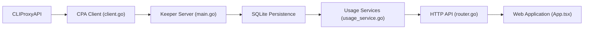

# Willxup/cpa-usage-keeper

> Tableau de bord qui conserve en SQLite les statistiques d'usage d'un proxy CLIProxyAPI, pour ses utilisateurs.

## Le problème
CLIProxyAPI (CPA) ne garde pas durablement ses données d'usage ; il manque historique, coûts et santé des requêtes.

## Ce que ça fait vraiment
Serveur Go avec front React : un poller récupère l'usage et la config via l'API de gestion de CPA (flux type Redis sur le port 8317), stocke tout dans SQLite, et calcule requêtes, tokens, coût, cache, RPM/TPM, latence. Il surveille fichiers d'auth et fournisseurs, rafraîchit les quotas, synchronise les tarifs, sauvegarde la base, et propose un classement communautaire optionnel.

## Comment c'est branché


## Essayer
```bash
cp deploy/docker-compose.example.yml docker-compose.yml
cp .env.example .env
docker compose up -d
```
Renseigner `CPA_BASE_URL`, `CPA_MANAGEMENT_KEY` et `LOGIN_PASSWORD`.

## Coût et pièges
Gratuit. Exige une instance CPA avec `usage-statistics-enabled: true`. La base SQLite et ses sauvegardes contiennent les données d'origine non chiffrées ; le service écoute sur toutes les interfaces par défaut.

## Ce que ce n'est pas
Ne remplace pas un outil d'observabilité LLM général : il ne parle qu'à CLIProxyAPI. Les rankings communautaires sont optionnels (à activer explicitement).

## Alternatives
Aucune alternative nommée dans le README.

## Pour toi
À ignorer, sauf si tu utilises déjà CLIProxyAPI : c'est un accessoire d'un proxy précis, pas un outil de suivi de LLM réutilisable.

