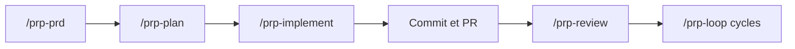

# Wirasm/PRPs-agentic-eng

> Collection de skills Claude Code qui transforment une demande en PRD, plan, implémentation et PR.

## Le problème
Un agent de code livre mieux avec un contexte précis, des motifs du code existant et des commandes de validation qu'avec une demande vague.

## Ce que ça fait vraiment
Un « Product Requirement Prompt » réunit un PRD, du contexte de code et un mode d'emploi pour l'agent. Skills fournis : `/prp-prd`, `/prp-plan`, `/prp-implement`, `/prp-review`, `/prp-commit`, `/prp-debug`, et `/prp-loop` qui enchaîne plan, implémentation, PR et relectures en sessions `claude -p`. Artefacts rangés sous `~/.prp/<projet>/`.

## Comment c'est branché


## Essayer
```bash
/plugin marketplace add Wirasm/PRPs-agentic-eng
/plugin install prp-core@prp-marketplace
/prp-loop "add user authentication with JWT" --until implement
```

## Coût et pièges
Gratuit, mais chaque boucle consomme des sessions Claude Code (limites : 3 cycles, 10 itérations d'implémentation par défaut). Les worktrees git parallèles sont conseillés.

## Ce que ce n'est pas
Pas un logiciel : ce sont des prompts en Markdown. Le README contient une publicité pour des ateliers payants. Le schéma d'architecture fourni décrit une ancienne version (`prp_runner.py`) et diverge du README actuel.

## Alternatives
Aucune alternative nommée dans le README.

## Pour toi
À surveiller : méthode utile pour cadrer un agent de code, mais dépôt d'une personne et licence non déclarée.
