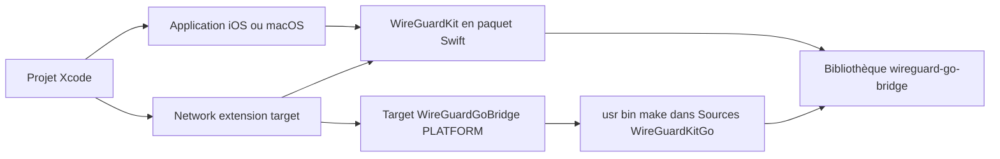

# WireGuard/wireguard-apple

> **Source of the WireGuard iOS and macOS apps, plus the reusable `WireGuardKit` Swift package.**

## The problem

Without this repository, putting a WireGuard tunnel inside an Apple app means wiring the Go
side of WireGuard to an iOS/macOS network extension by hand. The README never states this,
but the whole "WireGuardKit integration" section exists only because Swift Package Manager
cannot build the `wireguard-go-bridge` library on its own.

## What it actually does

The repository holds one application for iOS and one for macOS, along with many components
shared between the two; you switch platforms by picking the target inside Xcode. It also
ships `WireGuardKit` as a Swift package served from `https://git.zx2c4.com/wireguard-apple`,
which links against `wireguard-go-bridge`. That library is produced by an Xcode "External
Build System" target named `WireGuardGoBridge<PLATFORM>`, driven by `/usr/bin/make` inside
`Sources/WireGuardKitGo`. The README documents nothing else: no app features, no protocol
description, no configuration format.

## How it is wired



The README spells out the manual wiring: add the Swift package to your project, create one
external target per platform (`macOS` or `iOS`, with `SDKROOT` set to `macosx` or
`iphoneos`, directory
`${BUILD_DIR%Build/*}SourcePackages/checkouts/wireguard-apple/Sources/WireGuardKitGo`), then
add it as a dependency of the network extension and link `WireGuardKit` into both the
extension and the main app bundle. Steps 2 to 4 must be repeated twice when shipping for
both platforms.

## Trying it

```bash
git clone https://git.zx2c4.com/wireguard-apple
cd wireguard-apple
cp Sources/WireGuardApp/Config/Developer.xcconfig.template Sources/WireGuardApp/Config/Developer.xcconfig
vim Sources/WireGuardApp/Config/Developer.xcconfig
brew install swiftlint go
open WireGuard.xcodeproj
```

The README stops there and ends the build story with "flip switches, press buttons" inside
Xcode: no command-line build is documented.

## Cost and traps

The code is MIT licensed, no fee. The real cost is the Apple chain: a Mac with Xcode, a
developer team ID to fill into `Developer.xcconfig` — hence an Apple Developer account —
plus `swiftlint` and `go 1.19` installed through Homebrew. Main trap: `WireGuardKit` does
not build its Go bridge by itself, the external target has to be created by hand, and on
iOS Bitcode must be turned off (Build settings → Enable Bitcode → No). The Go version is
pinned to 1.19 in the README, which may have aged.

## What it is not

This is not WireGuard's core nor a protocol implementation: it is the Apple-side wrapper
sitting on `wireguard-go-bridge`. It is not a VPN service either: no server, no account, no
ready-made tunnel configuration. And it is not a one-line Swift package — most of the README
is spent on manually mounting the Go dependency, the rest being the MIT license text.

## Alternatives

The README names no competing project and no neighbours were supplied: no comparable
alternative in the catalogue. For a WireGuard tunnel on iOS or macOS this repository is the
upstream reference pointed at by the wireguard.com link in its title.

## For you

Low interest for a data / AI / MLOps profile: this is Apple application development, not data
tooling. Worth remembering only if you must open a WireGuard tunnel from an in-house iOS or
macOS client, for instance to reach a private training cluster; otherwise skip it.
