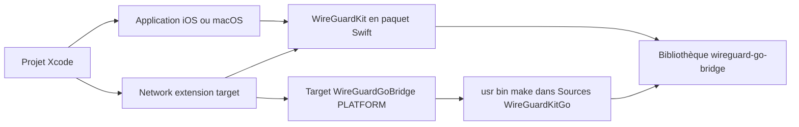

# WireGuard/wireguard-apple

> **Le code source des applications WireGuard iOS et macOS, plus le paquet Swift `WireGuardKit` réutilisable.**

## Le problème

Sans ce dépôt, intégrer un tunnel WireGuard dans une application Apple oblige à relier
soi-même la partie Go de WireGuard à une extension réseau iOS/macOS. Le README ne décrit
pas ce manque, mais toute la section « WireGuardKit integration » n'existe que parce que
Swift Package Manager ne sait pas construire seul la bibliothèque `wireguard-go-bridge`.

## Ce que ça fait vraiment

Le dépôt contient une application pour iOS et une pour macOS, ainsi que de nombreux
composants partagés entre les deux ; on bascule d'une plateforme à l'autre en changeant
de cible dans Xcode. Il expose aussi `WireGuardKit`, distribué en paquet Swift depuis
`https://git.zx2c4.com/wireguard-apple`, qui se lie à la bibliothèque
`wireguard-go-bridge`. Cette dernière est construite par un target Xcode « External
Build System » appelé `WireGuardGoBridge<PLATFORM>`, piloté par `/usr/bin/make` dans
`Sources/WireGuardKitGo`. Le README ne documente rien d'autre : ni les fonctionnalités
de l'application, ni le protocole, ni les formats de configuration.

## Comment c'est branché



Le README décrit le câblage manuel : on ajoute le paquet Swift au projet, on crée un
target externe par plateforme (`macOS` ou `iOS`, avec `SDKROOT` valant `macosx` ou
`iphoneos`, répertoire
`${BUILD_DIR%Build/*}SourcePackages/checkouts/wireguard-apple/Sources/WireGuardKitGo`),
puis on l'ajoute en dépendance de l'extension réseau et on lie `WireGuardKit` à
l'extension comme au bundle principal. Les étapes 2 à 4 sont à refaire deux fois si
l'application vise les deux plateformes.

## Essayer

```bash
git clone https://git.zx2c4.com/wireguard-apple
cd wireguard-apple
cp Sources/WireGuardApp/Config/Developer.xcconfig.template Sources/WireGuardApp/Config/Developer.xcconfig
vim Sources/WireGuardApp/Config/Developer.xcconfig
brew install swiftlint go
open WireGuard.xcodeproj
```

Le README s'arrête là et conclut la construction par « flip switches, press buttons » dans
Xcode : aucune commande de build en ligne de commande n'est documentée.

## Coût et pièges

Le code est sous licence MIT, sans frais. Le coût réel est la chaîne Apple : un Mac avec
Xcode, un identifiant d'équipe développeur à renseigner dans `Developer.xcconfig` — donc
un compte Apple Developer —, `swiftlint` et `go 1.19` installés par Homebrew. Piège
principal : `WireGuardKit` ne construit pas tout seul son pont Go, il faut créer à la main
le target externe, et sur iOS désactiver Bitcode (Build settings → Enable Bitcode → No).
La version de Go est figée à 1.19 dans le README, ce qui peut avoir vieilli.

## Ce que ce n'est pas

Ce n'est pas le cœur de WireGuard ni une implémentation du protocole : c'est l'habillage
Apple, qui s'appuie sur `wireguard-go-bridge`. Ce n'est pas un service VPN : il ne fournit
aucun serveur, aucun compte, aucune configuration de tunnel prête à l'emploi. Et ce n'est
pas un paquet Swift qui s'installe en une ligne — le README consacre l'essentiel de son
volume au montage manuel de la dépendance Go, le reste étant le texte de la licence MIT.

## Alternatives

Le README ne nomme aucun projet concurrent et aucun voisin n'est fourni : aucune
alternative comparable dans le catalogue. Pour un tunnel WireGuard sur iOS ou macOS, ce
dépôt est la référence amont citée par le site wireguard.com auquel renvoie le titre.

## Pour toi

Intérêt faible pour un profil data / IA / MLOps : c'est du développement applicatif Apple,
pas de l'outillage de traitement de données. À garder en tête seulement s'il faut ouvrir un
tunnel WireGuard depuis un client iOS ou macOS maison, par exemple pour joindre un cluster
d'entraînement privé ; sinon, passer son chemin.
