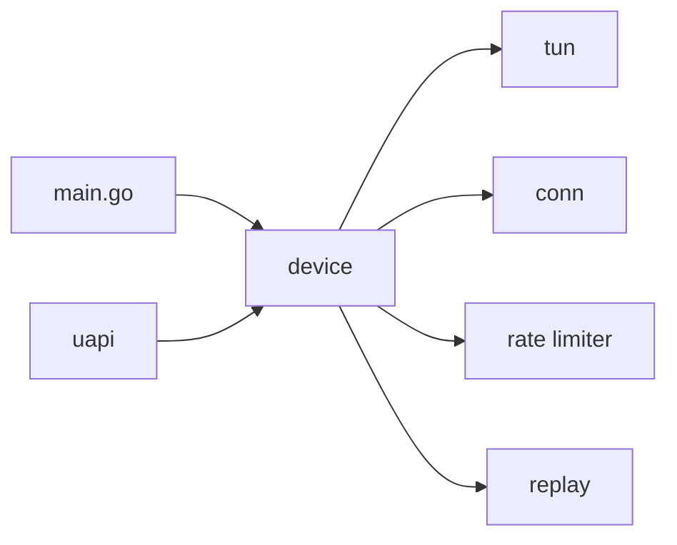

# WireGuard/wireguard-go

> Implémentation de WireGuard en Go, en espace utilisateur, pour les plateformes sans module noyau.

## Le problème
Utiliser des tunnels WireGuard sur des systèmes où le module noyau n'est pas disponible.

## Ce que ça fait vraiment
Un processus crée une interface virtuelle (`tun`), échange des paquets UDP chiffrés (`conn`) et exécute la machine d'états du protocole (`device`), avec pairs, IP autorisées et handshake Noise. Le paquet `ipc` expose l'interface UAPI pour `wg(8)`. Des paquets dédiés gèrent anti-rejeu et limitation de débit.

## Comment c'est branché


## Essayer
```bash
git clone https://git.zx2c4.com/wireguard-go
cd wireguard-go
make
wireguard-go wg0
wireguard-go -f wg0
```

## Coût et pièges
Gratuit. Sur Linux, le README recommande le module noyau, plus rapide. macOS, FreeBSD et OpenBSD n'ont pas les sticky sockets.

## Ce que ce n'est pas
Ce n'est pas l'application complète : sur Windows, il sert de module à l'appli officielle.

## Alternatives
- Module noyau WireGuard sur Linux : plus rapide et mieux intégré (selon le README).

## Pour toi
À surveiller : brique de référence pour relier machines ou clusters GPU en réseau privé, sans usage direct data/IA.

