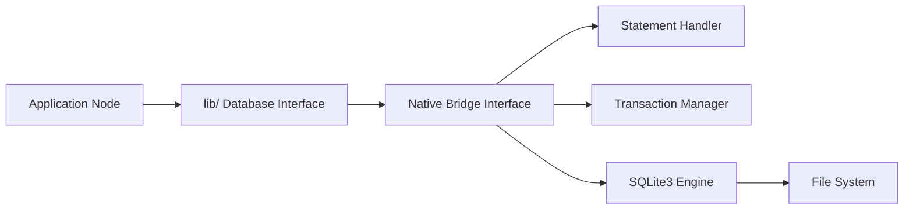

# WiseLibs/better-sqlite3

> Binding SQLite synchrone et rapide pour Node.js.

## Le problème
`node-sqlite3` est asynchrone pour des tâches sérialisées : lent, lourd, avec une gestion mémoire façon C.

## Ce que ça fait vraiment
Une API synchrone : `db.prepare(...).get/all/run`, des transactions complètes.
Des fonctions, agrégats et tables virtuelles définis par l'utilisateur, plus le chargement d'extensions.
Entiers 64 bits et worker threads pour les requêtes lentes.
Des binaires précompilés pour les plateformes majeures.

## Comment c'est branché


## Essayer
```bash
npm install better-sqlite3
```

## Coût et pièges
Gratuit. Il faut activer `journal_mode = WAL` pour de bonnes performances ; l'installation peut compiler si aucun binaire n'est disponible.

## Ce que ce n'est pas
Pas adapté aux écritures massivement concurrentes ni aux bases proches du téraoctet : dans ce cas, le README recommande PostgreSQL.

## Alternatives
- node-sqlite3 : API asynchrone, plus lente d'après le README.

## Pour toi
À adopter dès qu'un outil Node a besoin d'un stockage local : c'est le standard de fait, simple, et c'est exactement ce dont un petit service a besoin.
