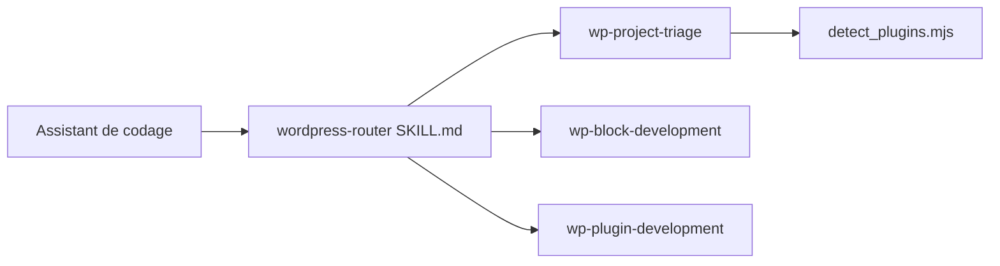

# WordPress/agent-skills

> Skills qui apprennent aux assistants de codage les bonnes pratiques de développement WordPress.

## Le problème
Les assistants génèrent des motifs WordPress dépassés, omettent la sécurité des extensions ou cassent les blocs Gutenberg.

## Ce que ça fait vraiment
Dix-huit skills : routeur de dépôt, triage de projet, blocs Gutenberg, thèmes à blocs, extensions, API REST, API Interactivity, API Abilities (avec audit et vérification), WP-CLI, performance, PHPStan, Playground, Blueprints, `wp-env`. Chaque skill contient un `SKILL.md`, des références et des scripts de détection. Le README précise que les skills ont été générées avec GPT-5.2 Codex puis relues par des contributeurs.

## Comment c'est branché


## Essayer
```bash
npx skills add WordPress/agent-skills --skill wp-plugin-development
npx skills add WordPress/agent-skills --list
node shared/scripts/skillpack-install.mjs --global
```

## Coût et pièges
Gratuit. Compatibilité indiquée : WordPress 7.0+ (PHP 7.4+). La licence est présente mais non identifiée par GitHub. Version 1, corrections attendues de la communauté.

## Ce que ce n'est pas
Pas un environnement WordPress : un ensemble de consignes. La qualité dépend de relectures humaines sur du texte généré par IA.

## Alternatives
Aucune alternative nommée dans le README.

## Pour toi
Ignorer : spécifique à WordPress, sans lien avec data/IA/MLOps ; seul le découpage en skills (routeur, triage, scripts de détection) peut inspirer les tiens.

