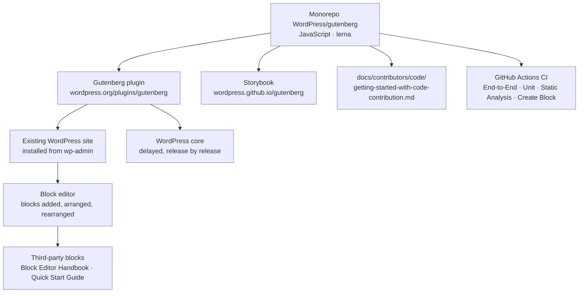

# WordPress/gutenberg

> **WordPress's block editor, shipped ahead of core as a plugin you install on an existing site.**

## The problem

Without the block editor, building a rich page in WordPress means shortcodes, custom HTML or a
third-party page builder — the README names those workarounds explicitly. And without this
plugin, you are stuck with whichever editor version is frozen into WordPress core: in-progress
features only land on the cadence of major releases.

## What it actually does

Gutenberg is the development hub for the WordPress block editor, and the plugin that
distributes its newest build before it reaches core.

- It splits content into **blocks**: every paragraph, image, gallery or heading is a unit you
  add, move and reorder.
- It exposes an extension surface for third-party developers; the README points to the Quick
  Start Guide and the Block Editor Handbook for writing your own blocks.
- It is a JavaScript monorepo **maintained with lerna** (README badge), with a component
  library published as a Storybook.
- The project follows a four-phase plan — Editing, Customization, **Collaboration** (real-time,
  asynchronous, publishing flows, revisions, admin design, library) and Multilingual. The
  README places it in phase two.
- The block editor has been available since December 2018; the plugin exists to test what is
  not yet settled.

## How it is wired

No code-derived diagram exists for this repository: the graph below is reconstructed from the
README alone, so it only shows the entry points it documents.



## Trying it

The README documents **no shell command at all** — no install, no build, no test. The only
paths it describes are the admin interface, a download and a set of links. Nothing is
reconstructed here:

```bash
# The README gives no commands. In plain words, it says:
#   1. try the live demo of the editor: https://wordpress.org/gutenberg/
#   2. install the plugin from the Plugins page in wp-admin,
#      or download it from https://wordpress.org/plugins/gutenberg/
#   3. to contribute code, follow
#      docs/contributors/code/getting-started-with-code-contribution.md
#      (a file in the repo, not reproduced in the README)
```

## Cost and gotchas

- **Free, but not standalone**: you need a running WordPress site. The plugin installs into it
  and is nothing on its own.
- **This is the ahead-of-core build**: the README speaks of bleeding-edge features to test. On
  a production site that is an accepted risk, not a default path.
- **GPL v2 or later** per the README — copyleft, so it propagates to anything distributed with
  it. The catalogue separately records `NOASSERTION`, meaning GitHub could not identify the
  license file: both flags are kept, and `LICENSE.md` should be read before any derived use.
- **No stated requirements**: the README gives no Node, PHP or WordPress version. Everything
  about the development environment is deferred to external files and sites.
- No API key, no GPU, no paid service. The discussion channel is Slack (`#core-editor`), free
  but requiring signup.

## What it is not

- **It is not WordPress.** It is the editor, not the CMS: no hosting, no database, no theme.
- **It is not a JavaScript library you drop into your own app.** The monorepo publishes
  packages, but the README only documents use as a WordPress plugin.
- **It is not the stable editor** — that one already ships inside WordPress core. Installing
  this plugin means choosing to run ahead and absorbing the regressions.
- The README is an **entry door**, not documentation: nearly all of its useful content sits
  behind links (handbook, guides, forums).

## Alternatives

No comparable alternative in the catalogue: the suggested neighbours
(`sqlmapproject/sqlmap`, `pydantic/pydantic`, `marimo-team/marimo`, `onsi/ginkgo`) cover
offensive security, data validation, Python notebooks and Go testing — none is a content
editor or a CMS extension. The README itself names no competing project; it only contrasts
itself with the old WordPress editor and the workarounds it replaces (shortcodes, custom HTML).

## For you

Skip it for data / AI / MLOps work: nothing here touches data, models or deployment, and the
README's substance is almost entirely outbound links. Keep it in mind only if a WordPress site
is in scope — a technical blog, an internal portal — in which case this is where the editor is
decided, and the Collaboration phase (real-time editing, revisions) is worth watching from a
distance.
