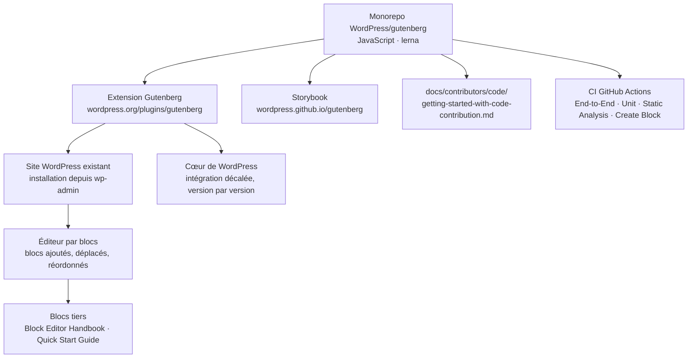

# WordPress/gutenberg

> **L'éditeur par blocs de WordPress, livré en avance de phase sous forme d'extension à installer.**

## Le problème

Sans éditeur par blocs, composer une page riche dans WordPress passe par des shortcodes, du
HTML personnalisé ou un constructeur tiers — le README cite explicitement ces contournements.
Et sans l'extension Gutenberg, on reste sur la version de l'éditeur figée dans le cœur de
WordPress : les fonctionnalités en cours de développement n'arrivent qu'au rythme des versions
majeures.

## Ce que ça fait vraiment

Gutenberg est le dépôt de développement de l'éditeur par blocs de WordPress, et l'extension
qui en distribue la version la plus récente, avant son intégration au cœur.

- Il découpe le contenu en **blocs** : chaque paragraphe, image, galerie ou titre est une unité
  qu'on ajoute, déplace et réordonne.
- Il expose une surface d'extension pour développeurs tiers : le README renvoie au *Quick Start
  Guide* et au *Block Editor Handbook* pour écrire ses propres blocs.
- C'est un monorepo JavaScript **géré avec lerna** (badge du README), avec une bibliothèque de
  composants publiée en Storybook.
- Le projet suit un plan en quatre phases — Édition, Personnalisation, **Collaboration**
  (temps réel, asynchrone, flux de publication, révisions, design de l'admin, bibliothèque),
  Multilingue. Le README le situe en phase deux.
- L'éditeur par blocs est disponible depuis décembre 2018 ; l'extension, elle, sert à tester
  ce qui n'est pas encore stabilisé.

## Comment c'est branché

Aucun diagramme tiré du code n'existe pour ce dépôt : le schéma ci-dessous est reconstruit
depuis le seul README, et ne montre donc que les chemins d'entrée qu'il documente.



## Essayer

Le README ne documente **aucune commande shell** — ni installation, ni build, ni test. Les
seuls chemins qu'il décrit sont l'interface d'administration, un téléchargement et des liens.
Rien n'est reconstruit ici :

```bash
# Aucune commande n'est donnée par le README. Il indique, en toutes lettres :
#   1. essayer la démo en ligne de l'éditeur : https://wordpress.org/gutenberg/
#   2. installer l'extension depuis la page « Extensions » de wp-admin,
#      ou la télécharger sur https://wordpress.org/plugins/gutenberg/
#   3. pour contribuer au code, suivre
#      docs/contributors/code/getting-started-with-code-contribution.md
#      (fichier du dépôt, non reproduit dans le README)
```

## Coût et pièges

- **Gratuit, mais pas autonome** : il faut un site WordPress qui tourne déjà. L'extension
  s'installe dedans ; elle n'est rien toute seule.
- **C'est la version d'avance** : le README parle de fonctionnalités *bleeding-edge* à tester.
  Sur un site en production, c'est un risque assumé, pas un chemin recommandé par défaut.
- **Licence GPL v2 ou ultérieure** d'après le README — copyleft, donc contaminante pour tout
  code distribué avec. Le catalogue relève par ailleurs `NOASSERTION`, c'est-à-dire que GitHub
  n'a pas su identifier le fichier : les deux alertes sont conservées, et le `LICENSE.md` du
  dépôt reste à lire avant tout usage dérivé.
- **Aucun prérequis chiffré** : ni version de Node, ni de PHP, ni de WordPress n'est donnée
  par le README. Tout ce qui concerne l'environnement de développement est renvoyé vers des
  fichiers et des sites externes.
- Pas de clé d'API, pas de GPU, pas de service payant. Le canal d'échange est Slack
  (`#core-editor`), gratuit mais avec inscription.

## Ce que ce n'est pas

- **Ce n'est pas WordPress.** C'est l'éditeur, pas le CMS : aucun hébergement, aucune base de
  données, aucun thème n'est fourni ici.
- **Ce n'est pas une bibliothèque JavaScript qu'on installe dans son application.** Le monorepo
  publie des paquets, mais le README ne documente que l'usage comme extension WordPress.
- **Ce n'est pas la version stable de l'éditeur** : celle-là est déjà dans le cœur de WordPress.
  Installer cette extension, c'est choisir d'être en avance et d'en absorber les régressions.
- Le README est une **porte d'entrée**, pas une documentation : presque tout son contenu utile
  est derrière des liens (handbook, guides, forums).

## Alternatives

Aucune alternative comparable dans le catalogue : les voisins proposés
(`sqlmapproject/sqlmap`, `pydantic/pydantic`, `marimo-team/marimo`, `onsi/ginkgo`) relèvent de
la sécurité offensive, de la validation de données, des notebooks Python et des tests Go —
aucun n'est un éditeur de contenu ni une extension CMS. Le README, de son côté, ne nomme aucun
projet concurrent : il ne se compare qu'à l'ancien éditeur de WordPress et aux contournements
qu'il remplace (shortcodes, HTML personnalisé).

## Pour toi

Passe ton chemin pour le travail data / IA / MLOps : rien ici ne touche aux données, aux
modèles ni au déploiement, et la matière du README est presque entièrement en liens sortants.
À garder en tête seulement si un site WordPress fait partie du périmètre — publication d'un
blog technique, portail interne — auquel cas c'est le dépôt où l'éditeur se décide, et la
phase « Collaboration » (temps réel, révisions) vaut d'être surveillée de loin.
