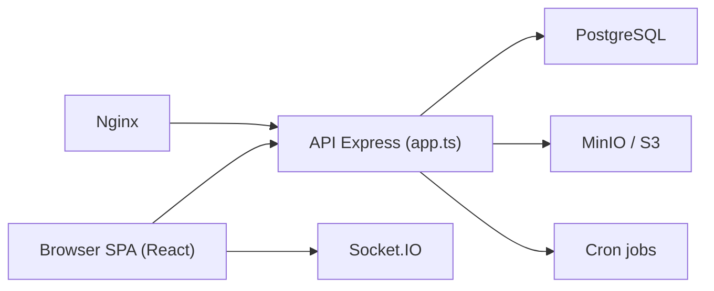

# Worklenz/worklenz

> Outil de gestion de projets et de tâches auto-hébergeable, avec suivi du temps et rapports.

## Le problème
Planifier projets, tâches et charge d'équipe sans passer par un SaaS de gestion de projet.

## Ce que ça fait vraiment
Application React (Ant Design) et backend TypeScript/Express sur PostgreSQL, avec Redis, stockage compatible S3 (MinIO par défaut, Azure Blob possible) et Socket.IO pour le temps réel. Tâches (sous-tâches, dépendances, récurrence, commentaires), vues kanban et planning, suivi du temps, rapports, notifications mail, tâches cron. Connexion locale ou Google (Passport).

## Comment c'est branché


## Essayer
```bash
git clone https://github.com/Worklenz/worklenz.git
cd worklenz
docker-compose up -d
# Frontend : http://localhost:5000  Backend : http://localhost:3000
```

## Coût et pièges
Gratuit auto-hébergé. Identifiants MinIO par défaut minioadmin/minioadmin à changer. Google Analytics est activé sur consentement (opt-in, selon le README). La licence est présente mais non identifiée par GitHub : à lire avant réutilisation.

## Ce que ce n'est pas
Pas un outil data/ML : c'est un gestionnaire de projet généraliste, avec des offres de facturation côté code.

## Alternatives
Non documenté dans le README.

## Pour toi
Ignorer : sans rapport avec ton travail data/IA, et la licence non identifiée est un frein.
