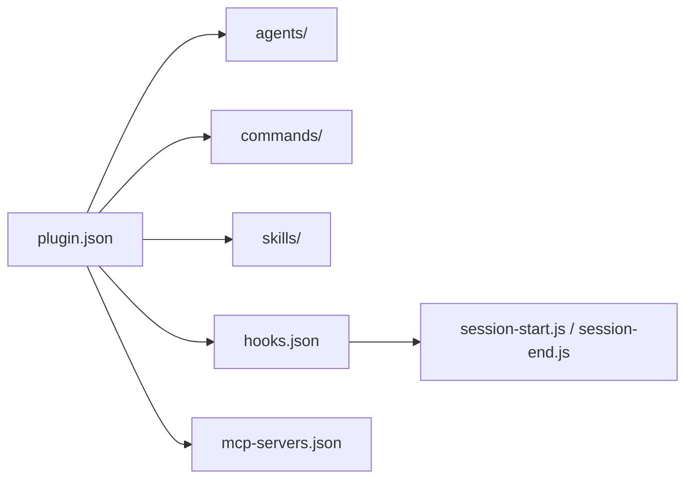

# WorldFlowAI/everything-claude-code

> Configs Claude Code (agents, skills, hooks, règles, MCP) d'un lauréat de hackathon, sous forme de plugin.

## Le problème
Repartir de zéro pour configurer sous-agents, commandes et hooks de Claude Code prend du temps.

## Ce que ça fait vraiment
Plugin avec neuf sous-agents (planner, architect, code-reviewer, security-reviewer…), skills (TDD, backend-patterns, continuous-learning, eval-harness…), commandes slash (`/tdd`, `/plan`, `/verify`…), règles, hooks Node.js (sauvegarde de session, suggestion de compactage) et détection du gestionnaire de paquets. Le code n'en est que la partie brute : les explications sont dans deux guides externes.

## Comment c'est branché


## Essayer
```bash
/plugin marketplace add affaan-m/everything-claude-code
/plugin install everything-claude-code@everything-claude-code
```

## Coût et pièges
Gratuit. Attention : ce dépôt (WorldFlowAI) semble être une copie de `affaan-m/everything-claude-code` (créé et poussé le même jour, 2026-01-23, aucune licence déclarée) ; les commandes du README pointent vers l'original. Le README avertit qu'activer trop de MCP réduit la fenêtre de contexte.

## Ce que ce n'est pas
Pas une configuration prête pour ta stack : l'auteur écrit lui-même que ce sont ses préférences, à adapter.

## Alternatives
Le dépôt original `affaan-m/everything-claude-code`, cité dans le README.

## Pour toi
Ignorer cette copie figée et sans licence ; si l'idée t'intéresse, pars de l'original et pioche skill par skill.
