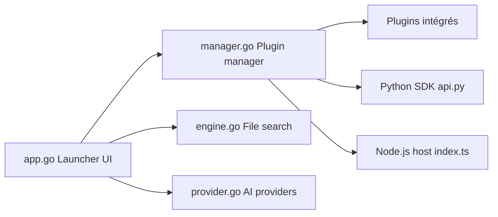

# Wox-launcher/Wox

> Lanceur clavier natif pour Windows, macOS et Linux, extensible par plugins, alternative à Raycast et Alfred.

## Le problème
Ouvrir applis, fichiers et actions sans quitter le clavier, sur plusieurs systèmes.

## Ce que ça fait vraiment
Une zone de saisie unique pour la recherche locale et les actions. Rendu GPU natif (pas Electron), environ 150 Mo de mémoire d'après le README. Plugins intégrés, ou en Node.js, Python et scripts depuis un store. Le code montre aussi la recherche de fichiers indexée, des fournisseurs d'IA, des thèmes et une synchronisation cloud.

## Comment c'est branché


## Essayer
```bash
brew install --cask wox
winget install -e --id Wox.Wox
scoop install extras/wox
choco install wox
yay -S wox-bin
```

## Coût et pièges
Gratuit. Les fonctions IA relèvent de fournisseurs externes ; la synchronisation passe par un compte Wox cloud (non détaillé). Licence GPL-3.0.

## Ce que ce n'est pas
Pas un outil de données ; les chiffres de mémoire sont ceux de l'auteur. Le câblage complet du runtime n'est pas vérifié.

## Alternatives
- Raycast : alternative nommée dans le README.
- Alfred : idem, propre à macOS.

## Pour toi
Surveiller : confort de poste de travail, pas de valeur pour un pipeline ; GPL-3.0 à garder en tête si tu écris des plugins redistribués.

