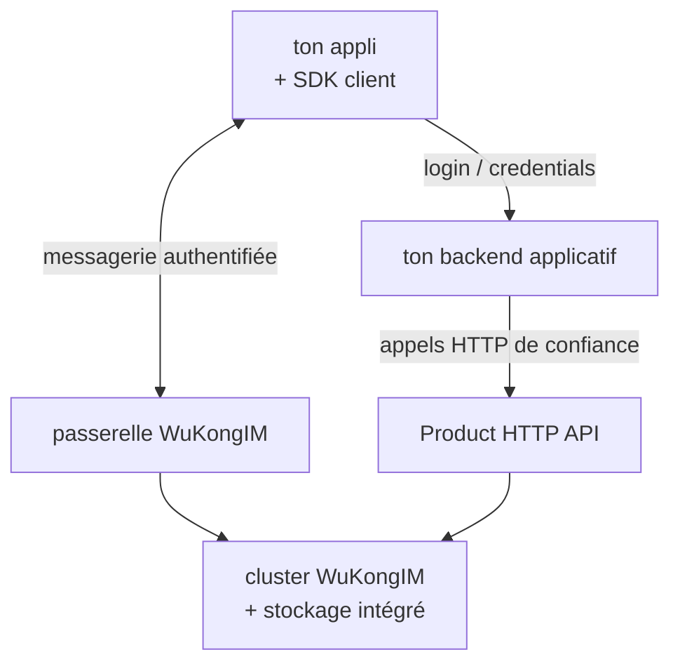

# WuKongIM/WuKongIM

> Serveur de messagerie auto-hébergé pour chats, groupes et notifications, stockage et cluster inclus.

## Le problème
Ajouter une messagerie à une appli implique d'habitude une base, un cache et une file de messages
externes, plus la synchronisation hors ligne et le multi-appareil à écrire soi-même.

## Ce que ça fait vraiment
Gère le stockage des messages, la synchronisation, la présence et la livraison en ligne ; l'appli
fournit l'interface, les comptes et les règles métier. Le stockage des messages, des métadonnées et
de la réplication est intégré : le cœur ne demande aucune base, cache ou file externe. Un seul modèle
de cluster, du nœud unique au multi-nœuds, avec 256 slots de hachage par défaut. Apporte l'ordre par
canal, la synchronisation hors ligne, les sessions multi-appareils et les canaux personnels, de
groupe ou personnalisés. Livre une démo de chat, un Manager, des métriques, du diagnostic et des
outils de sauvegarde.

## Comment c'est branché


## Essayer
```bash
curl -fsSL https://packages.githubim.com/repo | sudo sh
sudo apt update && sudo apt install -y wukongim
wukongim version
sudo wukongim init
sudo wukongim config validate --config /etc/wukongim/wukongim.toml
sudo systemctl enable --now wukongim
curl --retry 30 --retry-delay 2 --retry-all-errors --max-time 5 --fail http://127.0.0.1:5001/readyz
sudo journalctl -u wukongim -n 100 --no-pager
```

## Coût et pièges
Gratuit. Le mot de passe administrateur du Manager n'est affiché **qu'une fois** à l'initialisation.
Le paquet ne couvre qu'amd64 sur une liste fermée de distributions. L'API Product HTTP **n'a aucune
authentification d'appelant métier** : elle doit rester derrière un backend de confiance.

## Ce que ce n'est pas
Pas une appli de chat : ni UI, ni comptes, ni stockage de médias, ni logique de groupes/amis. Pas
stable : v3 en beta, APIs, configuration et formats durables annoncés comme susceptibles de changer.
Le rapport de performances cité porte sur un montage historique à trois processus sur un seul hôte,
pas sur la version courante.

## Alternatives
Aucune alternative nommée : le README n'oppose que ses deux SDK (WuKongIMSDK complet contre
WuKongEasySDK léger), et signale l'ancien SDK UniApp comme abandonné.

## Pour toi
Hors périmètre data / IA ; à noter seulement si un projet client réclame une messagerie souveraine.
