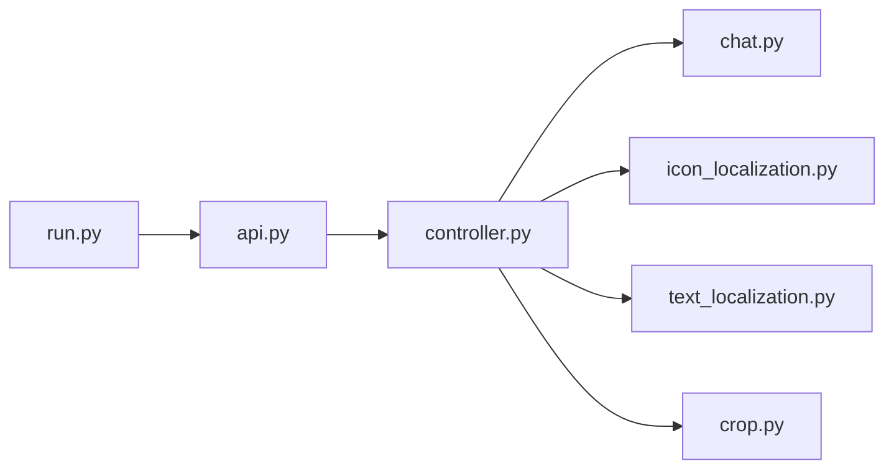

# X-PLUG/MobileAgent

> Famille d'agents GUI de Tongyi Lab (Alibaba) pour piloter téléphone, PC et web.

## Le problème
Faire exécuter à un modèle des tâches réelles dans des applications mobiles ou de bureau (réserver, comparer, remplir un document) reste difficile et peu fiable.

## Ce que ça fait vraiment
Le README est un index de travaux : Mobile-Agent v1 à v3.5, Mobile-Agent-E, PC-Agent, UI-S1 (RL semi-online), GUI-Critic-R1, et les modèles GUI-Owl 7B/32B/1.5 publiés sur Hugging Face. Chaque sous-dossier porte son code. D'après l'architecture, les variantes partagent des modules `api`, `chat`, `controller`, localisation d'icônes et de texte. Démos PC et téléphone décrites, API Bailian proposée.

## Comment c'est branché

(Diagramme fourni illisible : nœuds tirés de l'explication.)

## Essayer
Aucune commande documentée dans le README racine : l'installation se trouve dans chaque sous-dossier.

## Coût et pièges
Modèles 7B à 32B : GPU pour les servir en local, ou API Bailian (Alibaba Cloud). Le pilotage d'un téléphone suppose un appareil connecté.

## Ce que ce n'est pas
Pas un outil unique prêt à l'emploi : une collection de projets de recherche hétérogènes, chacun avec sa propre installation.

## Alternatives
Aucune alternative nommée dans le README.

## Pour toi
À surveiller pour suivre l'état de l'art des agents GUI et les modèles GUI-Owl ouverts, mais le README racine ne donne rien d'exécutable : il faut plonger dans chaque sous-projet.
