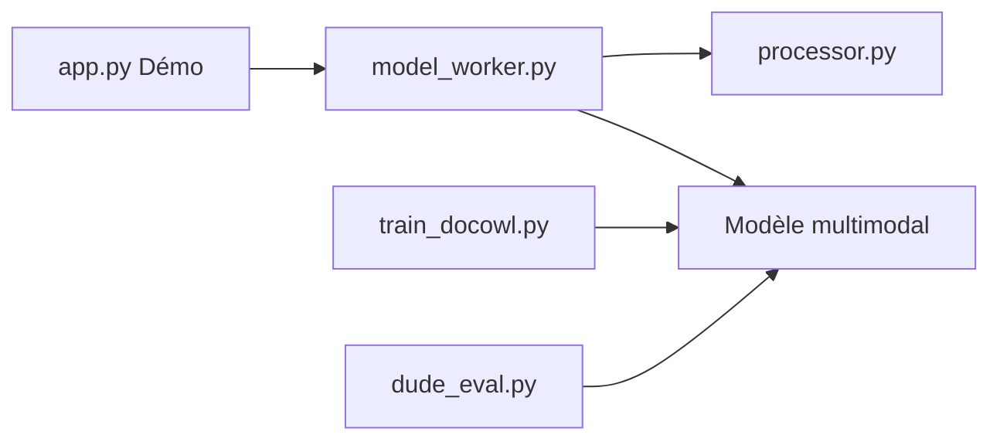

# X-PLUG/mPLUG-DocOwl

> Famille de modèles multimodaux d'Alibaba pour comprendre documents, graphiques et schémas sans OCR.

## Le problème
Lire des documents, tableaux et graphiques par OCR puis par un modèle de langage perd la mise en page et ajoute des erreurs.

## Ce que ça fait vraiment
Le README est court : il liste six modèles (DocOwl2, DocOwl1.5, TinyChart, PaperOwl, UReader, DocOwl) avec leurs articles (EMNLP, ACM MM, arXiv), et pointe vers des démos Hugging Face et ModelScope. L'architecture d'après le code montre des démos, des workers de génération, du fine-tuning et des scripts d'évaluation (DUDE, DUE) par sous-projet.

## Comment c'est branché

## Essayer
Aucune commande documentée dans ce README : passer par les démos en ligne ou par les README de chaque sous-projet (non fournis ici).

## Coût et pièges
Les poids sont à récupérer séparément ; le matériel requis n'est pas indiqué dans ce README. La démo Hugging Face est moins stable que celle de ModelScope (GPU ZeroGPU attribué dynamiquement). 73 issues ouvertes.

## Ce que ce n'est pas
Pas un paquet installable avec une API unique : c'est un dépôt de recherche regroupant plusieurs projets. Dernier push en mai 2025. Les performances annoncées ne sont pas dans ce texte.

## Alternatives
Aucune alternative nommée dans le README.

## Pour toi
À surveiller : pertinent pour l'extraction de documents sans OCR, mais il faut lire les sous-projets pour évaluer, et le dépôt est peu actif.

