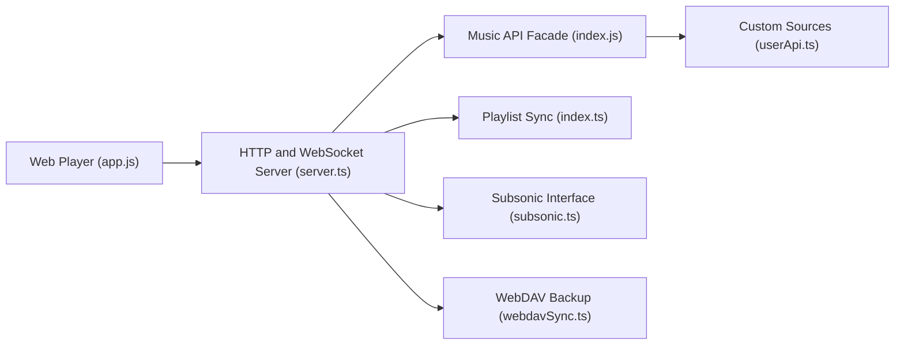

# XCQ0607/lxserver

> Serveur Node.js de synchronisation LX Music avec lecteur web et protocole Subsonic, documenté en chinois.

## Le problème
Synchroniser listes de lecture et favoris entre clients LX Music et écouter depuis un navigateur.

## Ce que ça fait vraiment
Serveur Express/WebSocket qui synchronise listes et « dislikes » des clients LX Music, sert un lecteur web (recherche multi-sources, cache, paroles, partage) et expose une interface Subsonic. Sauvegarde WebDAV, sources personnalisées importables, bibliothèque publique optionnelle, accès protégé par mot de passe.

## Comment c'est branché


## Essayer
```bash
docker run -d -p 9527:9527 -v $(pwd)/data:/server/data -v $(pwd)/logs:/server/logs -v $(pwd)/cache:/server/cache -v $(pwd)/music:/server/music --name lx-sync-server --restart unless-stopped xcq0607/lxserver:latest
git clone https://github.com/XCQ0607/lxserver.git && cd lxserver
npm ci && npm run build
npm start
```

## Coût et pièges
Mot de passe admin par défaut `123456` à changer. Statistiques PostHog anonymes actives par défaut (`DISABLE_TELEMETRY=true` pour les couper). Licence Apache-2.0 complétée par un avertissement sur les données protégées par droit d'auteur.

## Ce que ce n'est pas
Pas une source de musique légale : les liens audio viennent de scripts de sources tierces. L'avertissement impose de purger les données sous 24 h.

## Alternatives
Basé sur lyswhut/lx-music-sync-server ; clients Subsonic cités : Feishin, 音流.

## Pour toi
À ignorer : outil de streaming musical personnel, sans lien avec ton métier, et à risque juridique selon ses propres termes.

