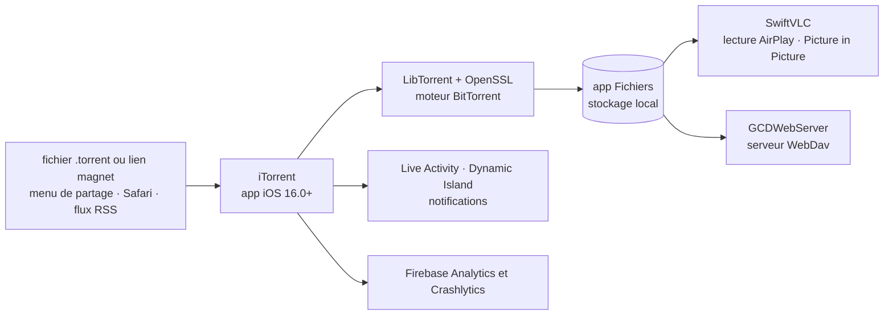

# XITRIX/iTorrent

> **A BitTorrent client for iPhone and iPad, installed outside the App Store, for people who download on iOS.**

## The problem

iOS has no BitTorrent client on the App Store: Apple's policy rules that category out. Without
a local client, you download on a computer or a NAS and then transfer the files to the phone,
losing background downloading, integration with the Files app, and playback while the download
is still running.

## What it actually does

iTorrent is an iOS torrent client with Files app support. The README lists its features:
background downloading, a progress widget through Live Activity and Dynamic Island, a built-in
VLC player with AirPlay and Picture in Picture, sequential downloading (so VLC can play a film
while it loads), adding `.torrent` files from the Share menu in Safari or other apps, adding
magnet links straight from Safari, storing files in the Files app, file sharing from the app,
downloading by link or by magnet, a notification when a torrent finishes, a WebDav server,
per-file download selection, a "Glass UI" for iOS 26, and RSS feeds.

The engine is not written here: the README lists LibTorrent and OpenSSL for the network and
crypto layer, SwiftVLC for playback, GCDWebServer for the WebDav server, plus MvvmFoundation,
CombineCocoa, SWXMLHash, MarqueeText, MarqueeLabel and the Firebase SDK. The app is translated
into English, German, Italian, Polish, Russian, Spanish and Simplified Chinese, and translation
help is invited. iOS 16.0 is the minimum, per the README badge.

## How it is wired



No code-derived diagram exists for this repository: the graph above is reconstructed from the
README alone, from its list of libraries and announced features. The actual Swift source file
names are therefore not documented here.

## Trying it

```
# No command is documented in the README: installation does not go through a
# command line but through download links.
```

The README gives no build or install command. It offers four download routes as badges:
AltStore PAL (limited to countries where Apple allows third-party stores, including the
European Union), AltStore Classic, SideStore, GitHub releases, and a jailbreak package. A
warning in the README states that only AltStore and SideStore are officially supported, and
that no technical support is provided for any other sideloading method.

## Cost and pitfalls

- **Free, but not installable the normal way.** Outside the EU and a few other countries, the
  README says there is "no official way to install the app": it must be sideloaded through
  AltStore or SideStore. Those tools bring their own constraint — an Apple developer certificate
  that has to be renewed periodically, which the README does not detail.
- **Telemetry is on.** The README says so itself: Firebase Analytics collects the country of the
  internet provider and session duration; Firebase Crashlytics collects, on a crash, the device
  model, orientation, free RAM and storage, iOS version, crash time and a detailed log of the
  faulting thread. The README states this data is statistical and cannot identify anyone. No
  opt-out is documented.
- **A dependency on a third-party Google service** (Firebase) inside an app whose use is, by
  nature, privacy-sensitive.
- **A single maintainer** (XITRIX / Vinogradov Daniil), funded by Patreon and PayPal donations.
- **iOS 16.0 minimum**, and the "Glass UI for iOS 26" line implies a very recent system for that
  interface.

## What it is not

- **It is not an App Store app.** It is not there and cannot be; sideloading is not an install
  detail but the only route, and it breaks as soon as the certificate expires or the third-party
  store stops working.
- **It is not a hosting service or a seedbox**: downloading happens on the device, on its
  storage, battery and connection. The WebDav server is for pulling files from another device,
  not for offloading the download.
- **It is not an original BitTorrent engine**: the protocol layer is LibTorrent's. This
  repository is the iOS shell — interface, system integration, player.
- **It is not a content search tool**: no index, no torrent search engine; you bring your own
  `.torrent` files, magnet links or RSS feeds.

## Alternatives

| | When to prefer it |
|---|---|
| **GopeedLab/gopeed** | The only neighbour in the catalogue, and only partly comparable: a multi-protocol download manager that also handles BitTorrent, but on desktop and server rather than as a native iOS app with Files, Live Activity and VLC integration. Prefer it if the downloading should run on a machine that stays on, rather than on a phone. |

The README names no competing client — the repositories it cites (LibTorrent, OpenSSL,
SwiftVLC, GCDWebServer, Firebase) are its dependencies, not alternatives. There is no other
defensible comparison in the catalogue.

## For you

Ignore it professionally: nothing here touches data, AI or MLOps, and the repository is Swift
for a single platform. The only transferable value is documentary — it is an honest example of
declaring telemetry in a README, and a useful reminder of what distribution outside the official
store costs. Strictly personal use, with the Firebase collection and the legal status of
downloaded content in mind.
