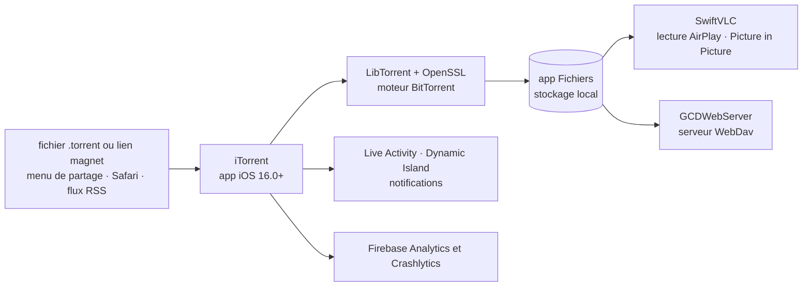

# XITRIX/iTorrent

> **Client BitTorrent pour iPhone et iPad, installé hors App Store, pour qui télécharge sur iOS.**

## Le problème

iOS n'a pas de client BitTorrent sur l'App Store : la politique d'Apple exclut ce type
d'application. Faute de client local, on télécharge sur un ordinateur ou un NAS puis on
transfère les fichiers sur le téléphone, et on perd le téléchargement en tâche de fond,
l'intégration à l'app Fichiers et la lecture en cours de téléchargement.

## Ce que ça fait vraiment

iTorrent est un client torrent iOS avec intégration à l'app Fichiers. Le README énumère ses
fonctions : téléchargement en tâche de fond, widget de progression en Live Activity et
Dynamic Island, lecteur VLC intégré avec AirPlay et Picture in Picture, téléchargement
séquentiel (pour regarder pendant le chargement), ajout de fichiers `.torrent` depuis le menu
de partage de Safari ou d'une autre app, ajout de liens magnet directement depuis Safari,
stockage dans l'app Fichiers, partage de fichiers depuis l'app, téléchargement par lien ou par
magnet, notification en fin de téléchargement, serveur WebDav, sélection des fichiers à
télécharger, interface « Glass UI » pour iOS 26, flux RSS.

Le moteur n'est pas maison : le README liste LibTorrent et OpenSSL pour la partie réseau et
chiffrement, SwiftVLC pour la lecture, GCDWebServer pour le serveur WebDav, plus
MvvmFoundation, CombineCocoa, SWXMLHash, MarqueeText, MarqueeLabel et le SDK Firebase.
L'application est traduite en anglais, allemand, italien, polonais, russe, espagnol et chinois
simplifié ; les contributions de traduction sont sollicitées. iOS 16.0 minimum d'après le badge
du README.

## Comment c'est branché



Aucun diagramme tiré du code n'existe pour ce dépôt : ce schéma est reconstruit depuis le seul
README, à partir de la liste des bibliothèques utilisées et des fonctions annoncées. Les noms
de fichiers réels du dépôt Swift ne sont donc pas documentés ici.

## Essayer

```
# Aucune commande n'est documentée dans le README : l'installation ne passe pas
# par une ligne de commande mais par des liens de téléchargement.
```

Le README ne donne aucune commande de compilation ni d'installation. Il pointe quatre voies de
téléchargement sous forme de boutons : AltStore PAL (réservé aux pays où Apple autorise les
boutiques tierces, dont l'Union européenne), AltStore Classic, SideStore, les *releases*
GitHub, et un paquet pour appareil jailbreaké. Un avertissement du README précise que seuls
AltStore et SideStore sont officiellement pris en charge, et qu'aucun support n'est fourni pour
les autres méthodes de sideload.

## Coût et pièges

- **Gratuit, mais pas installable normalement.** Hors UE et quelques autres pays, le README dit
  qu'« il n'existe aucun moyen officiel d'installer l'app » : il faut la sideloader via AltStore
  ou SideStore. Ces outils tiers imposent leur propre contrainte — un certificat de développeur
  Apple à renouveler périodiquement, ce que le README ne détaille pas.
- **Télémétrie activée.** Le README l'expose lui-même : Firebase Analytics collecte le pays du
  fournisseur d'accès et la durée des sessions ; Firebase Crashlytics collecte, en cas de plantage,
  le modèle d'appareil, l'orientation, la RAM et le stockage libres, la version d'iOS, l'heure et
  le journal détaillé du fil fautif. Le README affirme que ces données sont statistiques et non
  nominatives. Aucune option de désactivation n'est documentée.
- **Dépendance à un service tiers de Google** (Firebase) dans une application dont l'usage est,
  par nature, sensible au regard de la vie privée.
- **Un seul mainteneur** (XITRIX / Vinogradov Daniil), financé par des dons Patreon et PayPal.
- **iOS 16.0 minimum** ; la mention « Glass UI for iOS 26 » suppose un système très récent pour
  cette interface-là.

## Ce que ce n'est pas

- **Ce n'est pas une application App Store.** Elle n'y est pas et ne peut pas y être ; le sideload
  n'est pas un détail d'installation, c'est la seule voie, et elle casse dès que le certificat
  expire ou que la boutique tierce cesse de fonctionner.
- **Ce n'est pas un service d'hébergement ni un seedbox** : le téléchargement se fait sur
  l'appareil, avec son stockage, sa batterie et sa connexion. Le serveur WebDav sert à récupérer
  les fichiers depuis un autre appareil, pas à déporter le téléchargement.
- **Ce n'est pas un moteur BitTorrent original** : la partie protocole est celle de LibTorrent.
  Ce dépôt est l'enveloppe iOS — interface, intégration système, lecteur.
- **Ce n'est pas un outil de recherche de contenu** : ni index, ni moteur de recherche de
  torrents ; il faut apporter ses fichiers `.torrent`, ses liens magnet ou ses flux RSS.

## Alternatives

| | Quand le préférer |
|---|---|
| **GopeedLab/gopeed** | Seul voisin du catalogue, et seulement partiellement comparable : gestionnaire de téléchargement multiprotocole qui gère aussi BitTorrent, mais sur ordinateur et serveur, pas en application iOS native avec intégration Fichiers, Live Activity et lecteur VLC. À préférer si le téléchargement doit tourner sur une machine allumée en permanence plutôt que sur un téléphone. |

Le README ne nomme aucun client concurrent — les dépôts qu'il cite (LibTorrent, OpenSSL,
SwiftVLC, GCDWebServer, Firebase) sont ses dépendances, pas des alternatives. Il n'y a donc pas
d'autre comparaison défendable dans le catalogue.

## Pour toi

À ignorer sur le plan professionnel : rien ici ne touche à la donnée, à l'IA ou au MLOps, et le
dépôt est en Swift pour une plateforme unique. Le seul intérêt transposable est documentaire —
c'est un exemple honnête de déclaration de télémétrie dans un README, et un rappel utile de ce
que coûte la distribution hors boutique officielle. Usage strictement personnel, en connaissance
de la collecte Firebase et du cadre légal des contenus téléchargés.
