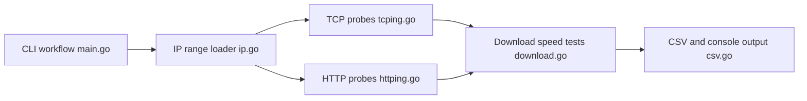

# XIU2/CloudflareSpeedTest

> Programme en ligne de commande qui mesure latence et débit des IP d'un CDN pour choisir la plus rapide.

## Le problème
Depuis la Chine continentale, les IP Cloudflare attribuées par défaut sont lentes et perdent des paquets. Trouver une bonne IP parmi toutes les plages publiées est fastidieux.

## Ce que ça fait vraiment
- Charge des plages d'IP (`ip.txt`, IPv4 et IPv6, ou `-ip`), teste chacune en TCP ou en HTTP, puis filtre sur latence et perte.
- Lance ensuite un test de téléchargement sur les plus rapides et classe par débit.
- Peut filtrer par code de région du nœud (Cloudflare, CloudFront, Fastly, Gcore, CDN77, Bunny) en mode HTTP.
- Écrit le résultat en CSV ; l'usage visé est de reporter l'IP choisie dans le fichier hosts.

## Comment c'est branché


## Essayer
```bash
wget -N https://github.com/XIU2/CloudflareSpeedTest/releases/latest/download/cfst_linux_amd64.tar.gz
tar -zxf cfst_linux_amd64.tar.gz
chmod +x cfst
./cfst
./cfst -tl 200 -dn 20
```

## Coût et pièges
Gratuit, binaire Go autonome. Le test HTTP est assimilable à du balayage réseau : à faible concurrence (`-n`) sur un serveur, sinon risque de suspension par l'hébergeur ou de limitation par Cloudflare. L'adresse de test par défaut n'est pas garantie.

## Ce que ce n'est pas
Pas un outil de performance pour ton propre réseau en Europe : l'intérêt tient à une situation de routage propre à la Chine continentale. Ne couvre pas WARP (UDP). Le README précise que Cloudflare interdit l'usage en proxy et que le risque est à la charge de l'utilisateur. README en chinois.

## Alternatives
- CloudflareST-Rust : réécriture en Rust du même outil.
- masgzy/CloudflareST : fork resté en Go.
- hoseinnikkhah/CloudflareSpeedTest-English : version avec textes en anglais.

## Pour toi
À ignorer : le problème résolu (routage CDN depuis la Chine) ne concerne pas un profil data/IA/MLOps hors de ce contexte, malgré un outil mûr et très suivi.

