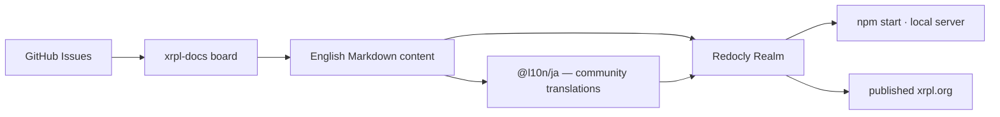

# XRPLF/xrpl-dev-portal

> **One sentence.** The source repository behind xrpl.org, the XRP Ledger documentation site, for people who want to contribute to it.

## The problem

Without this repository, the XRP Ledger documentation — covering the core server, the client
libraries and other open-source XRP Ledger software — has no public, editable source. This is
where a page on xrpl.org gets fixed, rather than merely reported.

## What it actually does

The repository holds the content and configuration of xrpl.org, described as the authoritative
source for XRP Ledger documentation. The site is built and published using Redocly; building it
locally goes through the `@redocly/realm` package. Documentation is written in English first and
then translated by community contributors: only the Japanese translations are live, while the
Spanish effort is incomplete and not actively used. The repository also acts as the issue desk
for the site, with an `xrpl-docs` Kanban board of six columns (No Status, Backlog, Planned, In
Progress, In Review, Done) that contributors are expected to keep current. Issues about
`xrpld`/`rippled`, Clio or the client libraries belong in their own repositories.

## How it is wired



No code-derived diagram exists for this repository; the graph above is rebuilt from the README,
which names `CONTRIBUTING.md`, `CODE-OF-CONDUCT.md` and the `@l10n/ja/` directory.

## Trying it

```bash
git clone git@github.com:XRPLF/xrpl-dev-portal.git && cd xrpl-dev-portal
npm install @redocly/realm
git switch master
npm start
```

## Cost and gotchas

Free; nothing to pay. You need Node.js and NPM — the README states the site is tested with the
current LTS release of each. The main catch is the publishing chain: it relies on Redocly, a
third-party product whose `@redocly/realm` package must be installed separately, and the
repository documents nothing about that tool's terms. The catalogue records the licence as
`NOASSERTION` and the README mentions none, so the reuse status of the content is unclear.
Translating means following a process documented elsewhere, on xrpl.org.

## What it is not

It is not the XRP Ledger itself, not a node and not an SDK: the server code (`xrpld`/`rippled`),
Clio and the client libraries (`xrpl.js`, `xrpl-py`) live in other XRPLF repositories, and the
README explicitly redirects issues about them there. It is also not a reusable site generator —
it is the content of one specific site, and the rendering toolchain belongs to Redocly. The
catalogue's "JavaScript" label is misleading: the substance here is documentation, not a library.

## Alternatives

No comparable alternative in the catalogue: the repositories named in the README (`rippled`,
Clio, `xrpl.js`, `xrpl-py`) are the software this site documents, not substitutes for the site.

## Why it matters to you

For a data / AI / MLOps profile, skip it unless you specifically work on the XRP Ledger: this is
a blockchain ecosystem's documentation repository with no reusable code. At most, it is an
example of a docs-as-code pipeline on Redocly with community localization.
