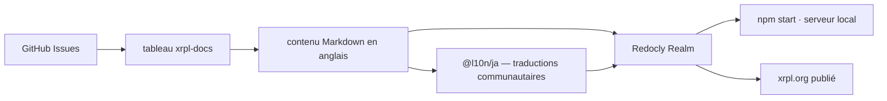

# XRPLF/xrpl-dev-portal

> **Une phrase.** Le code source du site de documentation du XRP Ledger, xrpl.org, pour qui veut y contribuer.

## Le problème

Sans ce dépôt, la documentation du XRP Ledger — serveur principal, bibliothèques clientes et
autres logiciels open source de l'écosystème — n'a pas de source publique modifiable. C'est
le lieu où l'on corrige une page de xrpl.org plutôt que de signaler l'erreur dans le vide.

## Ce que ça fait vraiment

Le dépôt contient le contenu et la configuration du site xrpl.org, présenté comme la source
faisant autorité pour la documentation du XRP Ledger. Le site est construit et publié avec
Redocly ; la construction locale passe par le paquet `@redocly/realm`. La documentation est
rédigée en anglais d'abord, puis traduite par des contributeurs de la communauté : seules les
traductions japonaises sont en ligne, l'espagnol est incomplet et inutilisé. Le dépôt sert
aussi de guichet des tickets pour le site, avec un tableau Kanban `xrpl-docs` à six colonnes
(No Status, Backlog, Planned, In Progress, In Review, Done) que les contributeurs tiennent à
jour. Les tickets visant `xrpld`/`rippled`, Clio ou les bibliothèques clientes vont ailleurs.

## Comment c'est branché



Aucun diagramme tiré du code n'existe pour ce dépôt : ce schéma est reconstruit depuis le
README, qui nomme `CONTRIBUTING.md`, `CODE-OF-CONDUCT.md` et le répertoire `@l10n/ja/`.

## Essayer

```bash
git clone git@github.com:XRPLF/xrpl-dev-portal.git && cd xrpl-dev-portal
npm install @redocly/realm
git switch master
npm start
```

## Coût et pièges

Gratuit, rien à payer. Il faut Node.js et NPM installés — le README précise que le site est
testé avec la version LTS courante de chacun. Le piège principal est la chaîne de publication :
elle repose sur Redocly, un produit tiers, dont le paquet `@redocly/realm` doit être installé
séparément ; le dépôt ne documente pas les conditions d'usage de cet outil. La licence est
déclarée `NOASSERTION` dans le catalogue et le README n'en mentionne aucune : le statut de
réutilisation du contenu n'est pas clair. Traduire suppose de suivre un processus décrit
ailleurs, sur xrpl.org.

## Ce que ce n'est pas

Ce n'est pas le XRP Ledger lui-même, ni un nœud, ni un SDK : le code du serveur (`xrpld`/
`rippled`), de Clio et des bibliothèques clientes (`xrpl.js`, `xrpl-py`) vit dans d'autres
dépôts de l'organisation XRPLF, et le README renvoie explicitement les tickets les concernant
là-bas. Ce n'est pas non plus un générateur de site réutilisable : c'est le contenu d'un site
précis, et l'outillage de rendu appartient à Redocly. Le classement « JavaScript » du catalogue
est trompeur — la matière est de la documentation, pas une bibliothèque.

## Alternatives

Aucune alternative comparable dans le catalogue : les dépôts nommés dans le README (`rippled`,
Clio, `xrpl.js`, `xrpl-py`) sont les briques logicielles documentées par ce site, pas des
substituts à ce site.

## Pour toi

Pour un profil data / IA / MLOps, passe ton chemin sauf si tu travailles précisément sur le
XRP Ledger : c'est un dépôt de documentation d'écosystème blockchain, sans code réutilisable.
À la rigueur, un exemple de chaîne docs-as-code Redocly avec localisation communautaire.
