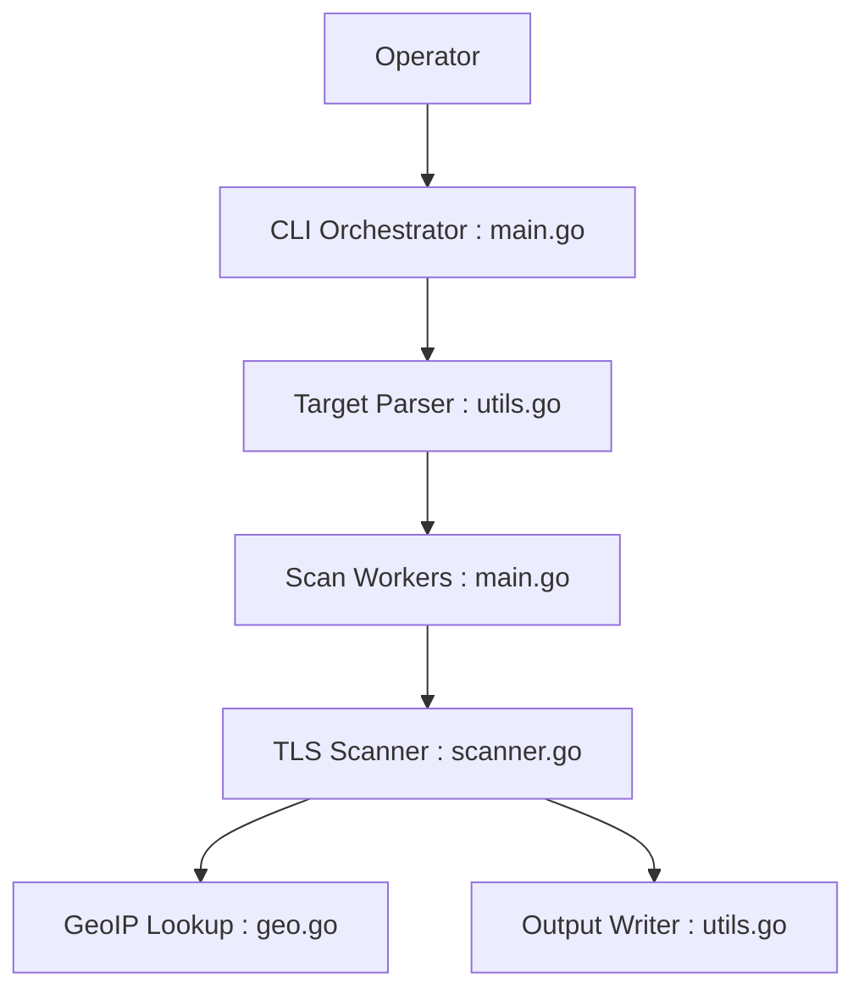

# XTLS/RealiTLScanner

> Scanner TLS en ligne de commande qui repère des hôtes utilisables comme cibles pour le protocole Reality.

## Le problème
Trouver des serveurs TLS 1.3 avec ALPN h2 pour configurer Reality (XTLS).

## Ce que ça fait vraiment
Prend une adresse, une plage CIDR, un domaine, un fichier ou une URL à explorer, résout les cibles, scanne en parallèle, indique version TLS, ALPN, domaine et émetteur du certificat, ajoute le pays via une base MaxMind optionnelle, et écrit un CSV (`out.csv` par défaut).

## Comment c'est branché


## Essayer
```bash
go build
./RealiTLScanner -addr 1.2.3.4
./RealiTLScanner -in in.txt -thread 10 -out file.csv
docker build -t realitlscanner .
```

## Coût et pièges
Gratuit. Go 1.21+. À lancer en local : depuis un VPS cloud, l'hôte risque d'être signalé. Scanner des plages d'IP exige d'avoir le droit de le faire. Licence MPL-2.0 (copyleft faible, par fichier).

## Ce que ce n'est pas
Pas un scanner de vulnérabilités : il ne fait que relever les paramètres TLS.

## Alternatives
Aucune alternative nommée dans le README.

## Pour toi
À ignorer : outil réseau de niche lié à Reality/XTLS, sans lien avec data/IA/MLOps.

