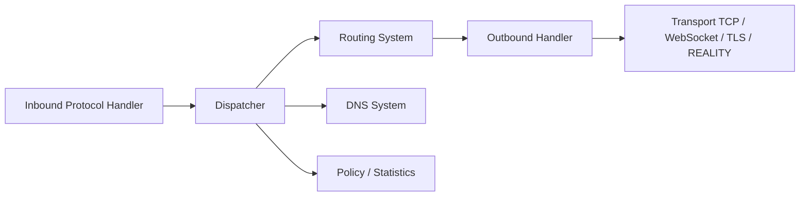

# XTLS/Xray-core

> Boîte à outils réseau et proxy issue du protocole XTLS (Xray-core, REALITY), pour administrateurs réseau.

## Le problème
Le README ne décrit pas de problème : c'est surtout un index d'installateurs, de panneaux web, de clients graphiques et d'exemples.

## Ce que ça fait vraiment
Xray-core, forké de v2fly-core, est un cœur de proxy en Go. D'après l'architecture : gestionnaires d'entrée et de sortie, protocoles (VLESS, VMess, Shadowsocks, Trojan), transports (TCP, UDP, WebSocket, TLS, REALITY), routage, DNS, politiques, statistiques et observatoire. Le dispatcher relie entrées et sorties.

## Comment c'est branché


## Essayer
```bash
brew install xray
CGO_ENABLED=0 go build -o xray -trimpath -buildvcs=false -ldflags="-s -w -buildid=" -v ./main
```

## Coût et pièges
Gratuit. Compilation avec Go, ou installation par script Linux, Docker ou Homebrew ; panneaux et clients cités sont des projets tiers. Le paquet Windows embarque `wintun.dll` sous sa propre licence, redistribuée telle quelle. MPL-2.0 : copyleft par fichier.

## Ce que ce n'est pas
Ni un VPN clé en main ni un outil documenté pour débutants : la configuration passe par la documentation externe.

## Alternatives
- Aucune alternative nommée dans le README.

## Pour toi
Ignorer : un outil de proxy réseau sans lien avec un flux data/IA/MLOps, et un README qui ne sert que d'index.

