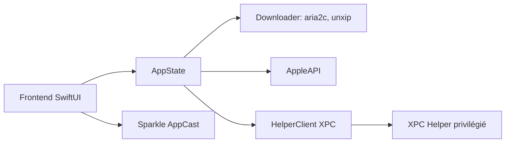

# XcodesOrg/XcodesApp

> Application macOS pour installer et basculer entre plusieurs versions de Xcode.

## Le problème
Installer, garder et changer de version de Xcode à la main est long et sujet aux erreurs.

## Ce que ça fait vraiment
Liste les versions disponibles (données Xcode Releases ou site développeur Apple) et installe de bout en bout, avec `aria2` pour télécharger sur plusieurs connexions et `unxip` pour l'extraction. Reprise automatique après erreur réseau, activation d'une version via `xcode-select`, installation des plateformes et runtimes, variantes Apple Silicon. Les opérations privilégiées passent par un assistant XPC.

## Comment c'est branché


## Essayer
```bash
brew install --cask xcodes
```
Ou télécharger `Xcodes.zip` sur la page des releases et le déplacer dans `/Applications`.

## Coût et pièges
Gratuit, mais un Apple ID est requis pour télécharger Xcode. Les versions 2.x et 3.x demandent macOS 13. Compiler l'app exige macOS et Xcode 26. Changer la version de l'assistant XPC demande à l'utilisateur de le réinstaller.

## Ce que ce n'est pas
Ce n'est pas un gestionnaire de versions pour autre chose que Xcode. Le README indique une version en ligne de commande, `xcodes`, distincte.

## Alternatives
`xcodes` (CLI) : même rôle en terminal, cité par le README.

## Pour toi
Ignorer : utilitaire pour développeurs Apple, sans intérêt pour un travail data/IA/MLOps.

