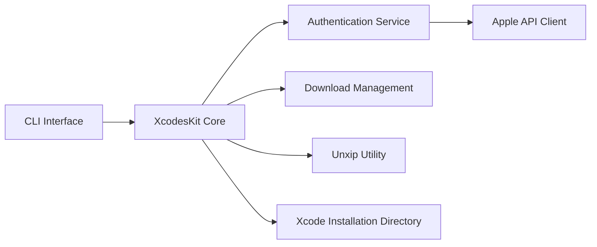

# XcodesOrg/xcodes

> Ligne de commande macOS pour installer et basculer entre plusieurs versions d'Xcode.

## Le problème
Télécharger, décompresser et sélectionner plusieurs Xcode à la main est lent, surtout sur des runners CI.

## Ce que ça fait vraiment
Un CLI Swift s'authentifie auprès d'Apple (identifiant conservé dans le trousseau), télécharge les archives (aria2 si présent), les décompresse (option unxip expérimentale), les déplace dans `/Applications` et sélectionne la version. Il gère aussi les runtimes simulateurs et un fichier `.xcode-version`.

## Comment c'est branché


## Essayer
```bash
brew install xcodesorg/made/xcodes
xcodes install 10.2.1
xcodes install --latest --experimental-unxip
xcodes list --architecture arm64
xcodes runtimes install "iOS 17.0-beta1"
```

## Coût et pièges
Gratuit, mais il faut un compte Apple Developer ; identifiants via `XCODES_USERNAME` et `XCODES_PASSWORD`. Le mot de passe superutilisateur est demandé en fin d'installation.

## Ce que ce n'est pas
Ce n'est pas un gestionnaire pour Linux : macOS seulement. Le qualificatif « best » du README est un slogan.

## Alternatives
- Xcodes.app : version application, citée dans le README.
- xcode-install et fastlane/spaceship : crédités comme source d'inspiration.

## Pour toi
À ignorer : outil de poste macOS pour développeurs Apple, sans intérêt pour un pipeline data/IA.

