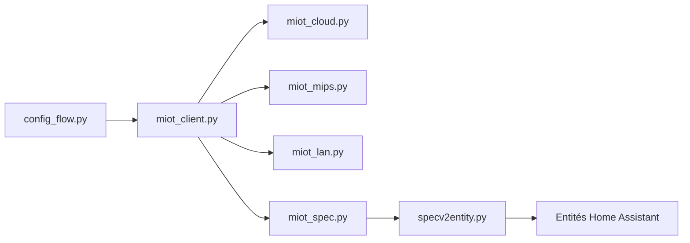

# XiaoMi/ha_xiaomi_home

> Intégration officielle Xiaomi pour piloter les appareils MIoT depuis Home Assistant.

## Le problème
Les appareils Xiaomi vivent dans l'appli Xiaomi Home ; il faut un pont pour les intégrer à Home Assistant.

## Ce que ça fait vraiment
Connexion OAuth 2.0 au compte Xiaomi, import des appareils choisis, puis création d'entités Home Assistant d'après la spécification MIoT-Spec-V2 (propriété → switch, capteur, nombre…). Contrôle par le cloud (MQTT pour les événements, HTTP pour les commandes), ou en local via la passerelle centrale (Chine continentale seulement) ; un mode LAN partiel est dédéconseillé.

## Comment c'est branché


## Essayer
```bash
cd config
git clone https://github.com/XiaoMi/ha_xiaomi_home.git
cd ha_xiaomi_home
./install.sh /config
```

## Coût et pièges
Gratuit, mais compte Xiaomi requis. Jetons et certificats stockés en clair dans la configuration de Home Assistant. Bluetooth, infrarouge et appareils virtuels non pris en charge. Licence présente mais non identifiée.

## Ce que ce n'est pas
Pas un contrôle 100 % local : sans passerelle, tout passe par le cloud Xiaomi.

## Alternatives
Aucune alternative nommée dans le README.

## Pour toi
Hors périmètre data/IA ; utile uniquement si tu as un parc Xiaomi domestique sous Home Assistant.

