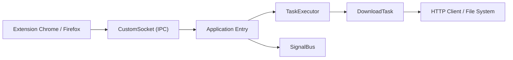

# XiaoYouChR/Ghost-Downloader-3

> Gestionnaire de téléchargements multiplateforme couvrant HTTP, BitTorrent, FTP, M3U8, DASH et eD2k, avec extension de navigateur.

## Le problème
Utiliser cinq outils différents pour télécharger fichiers, torrents, flux vidéo et dépôts est fastidieux.

## Ce que ça fait vraiment
Application de bureau (Windows, macOS, Linux, Android) en Python et Qt : découpage adaptatif des fichiers sans fusion, empreintes TLS de navigateur, analyseurs YouTube, Bilibili, GitHub et Hugging Face avec accélération par miroir, RPC compatible aria2. Une extension Chrome/Firefox détecte les médias de la page et confie le téléchargement à l'application via un socket local. Système de plugins.

## Comment c'est branché

## Essayer
Le README ne contient pas de commande d'installation : il renvoie à la documentation et aux publications. Aucune commande reprise.

## Coût et pièges
Gratuit, licence GPL-3.0. Qt 6.6+ exige un processeur avec AVX. Les téléchargements de vidéos peuvent contrevenir aux conditions des plateformes.

## Ce que ce n'est pas
Pas un outil de collecte de données structuré : c'est un téléchargeur générique.

## Alternatives
yt-dlp, N_m3u8DL-RE et libtorrent, cités comme composants ou références.

## Pour toi
À surveiller : pratique pour récupérer de gros modèles ou jeux de données depuis Hugging Face avec miroirs, mais wget ou huggingface-cli suffisent souvent.

