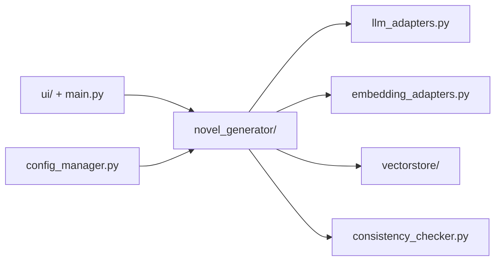

# YILING0013/AI_NovelGenerator

> Application de bureau qui génère des romans longs avec un LLM, en gardant cohérence et mémoire du récit.

## Le problème
Un LLM seul perd le fil sur un long texte : personnages, intrigues et indices oubliés.

## Ce que ça fait vraiment
Interface graphique en quatre étapes : paramètres du monde, plan des chapitres, brouillon, finalisation. À chaque chapitre, elle relit résumé global, état des personnages et arcs, interroge un magasin vectoriel et met à jour ces fichiers. Vérification optionnelle des contradictions. Adaptateurs LLM et embeddings (OpenAI, DeepSeek, Gemini, Ollama), configurables par tâche.

## Comment c'est branché


## Essayer
```bash
git clone https://github.com/YILING0013/AI_NovelGenerator
cd AI_NovelGenerator
pip install -r requirements.txt
python main.py
pip install pyinstaller
pyinstaller main.spec
```

## Coût et pièges
Clés d'API et consommation de tokens à ta charge (ou Ollama en local). Compilateur C++ parfois requis sous Windows. L'auteur annonce peu de temps de maintenance et une refonte dans une branche `dev`.

## Ce que ce n'est pas
Pas une garantie de qualité littéraire ; la cohérence reste à relire. AGPL-3.0.

## Alternatives
Aucune nommée dans le README.

## Pour toi
À surveiller comme exemple de mémoire longue (résumés, état, RAG) autour d'un LLM ; projet instable en attente de refonte.

