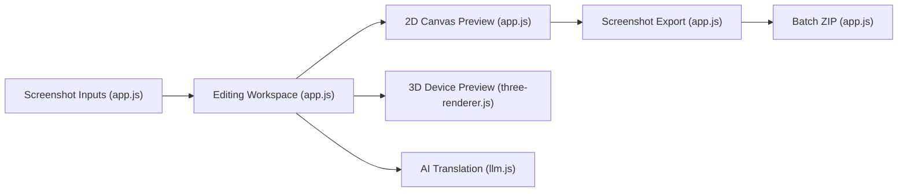

# YUZU-Hub/appscreen

> Éditeur web gratuit pour fabriquer des captures d'écran App Store avec fonds, textes et maquettes 3D.

## Le problème
Produire à la main les visuels aux bonnes tailles (iPhone, iPad) pour la fiche d'une app mobile.

## Ce que ça fait vraiment
- Charge des captures, choisit la taille de sortie, personnalise fond (dégradé, couleur, image), texte et appareil (2D ou iPhone 3D).
- Export unitaire ou ZIP global.
- Traduction IA optionnelle des titres (Claude, OpenAI ou Google) avec une clé saisie par l'utilisateur, stockée dans le navigateur.
- JavaScript pur, Canvas, Three.js, IndexedDB.

## Comment c'est branché


## Essayer
```bash
python3 -m http.server 8000
npx serve .
docker run -d -p 8080:80 ghcr.io/yuzu-hub/appscreen:latest
```
Ou utiliser directement la version hébergée sur GitHub Pages.

## Coût et pièges
Gratuit ; la traduction IA consomme votre clé d'API. Données dans IndexedDB du navigateur. Modèles 3D sous CC BY 4.0 (attribution).

## Ce que ce n'est pas
Pas un générateur de captures automatiques : il faut fournir ses images. Aucune licence déclarée dans le dépôt, donc droits de réutilisation du code incertains.

## Alternatives
Aucune alternative nommée dans le README.

## Pour toi
À ignorer : utilitaire de marketing mobile, hors périmètre data/IA, et sans licence claire.

