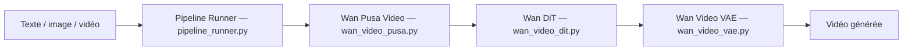

# Yaofang-Liu/Pusa-VidGen

> Modèle de diffusion vidéo à pas de temps vectorisés, adaptant Wan et Mochi pour plusieurs tâches vidéo.

## Le problème
Adapter un grand modèle vidéo à l'image-vers-vidéo, à l'extension ou aux images début/fin coûte cher en entraînement et en données.

## Ce que ça fait vraiment
Pusa applique un contrôle de bruit par image (pas de temps vectorisés) sur Wan2.1/Wan2.2 (V1.0) ou Mochi (V0.5), via des LoRA. Une même base sert texte-vidéo, image-vidéo, images début/fin, extension et transition. Le README annonce un coût d'entraînement d'environ 500 $ et un score VBench-I2V de 87,32 %, chiffres non vérifiés ici. LightX2V permet 4 étapes d'inférence.

## Comment c'est branché


## Essayer
```bash
git clone https://github.com/genmoai/models
cd models
pip install uv
uv venv .venv
source .venv/bin/activate
uv pip install setuptools
uv pip install -e . --no-build-isolation
huggingface-cli download RaphaelLiu/Pusa-V0.5 --local-dir <path_to_downloaded_directory>
```
(Chemin V0.5 ; les instructions V1.0 sont dans un autre README, non fourni.)

## Coût et pièges
GPU (exemple du README sur 4 GPU), poids à télécharger sur Hugging Face. Les instructions V1.0, la version principale, ne sont pas dans ce README. Dernier push en février 2026.

## Ce que ce n'est pas
Pas un service prêt à l'emploi. La qualité dépend du modèle de base, avec un écart de rendu entre images de conditionnement et images générées (décalage de couleurs), d'après le README.

## Alternatives
Wan-Video : le modèle de base, sans adaptation Pusa. Mochi : base de la V0.5.

## Pour toi
À surveiller : intéressant pour comprendre l'adaptation peu coûteuse d'un modèle vidéo, mais inutile sans GPU sérieux et loin d'une brique MLOps.

