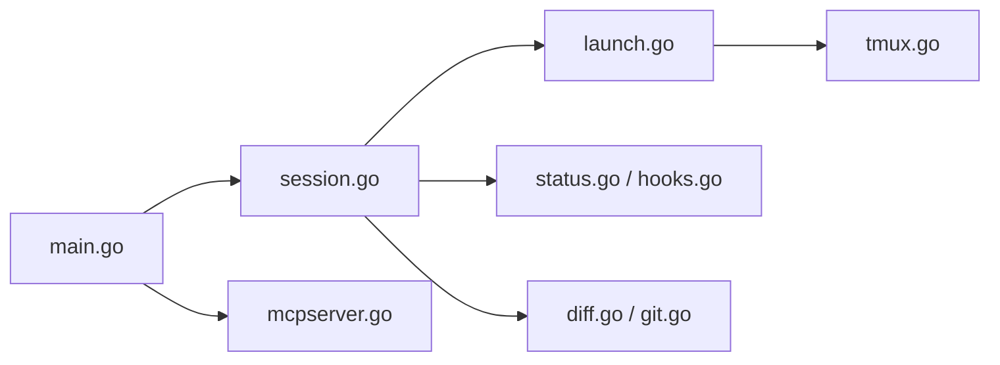

# YoanWai/agent-manager

> Tableau de bord terminal pour piloter plusieurs agents de code, chacun dans sa session tmux persistante.

## Le problème
Avec plusieurs agents en cours, on cherche dans des onglets lequel a fini, lequel est bloqué, et on perd le fil des modifications.

## Ce que ça fait vraiment
Chaque agent (Claude Code, Codex, OpenCode, Gemini CLI…) tourne dans une session tmux privée (serveur `agentmgr`), listée avec son état en direct et groupée en arbre de projets. On répond sans s'attacher (`space`), on ressuscite une session (`v`), on relit les diffs fichier complet (`ctrl+r`) avec commentaires renvoyés à l'agent. Les agents peuvent en lancer d'autres via des outils MCP.

## Comment c'est branché


## Essayer
```bash
brew install agent-manager
# ou
curl -fsSL https://raw.githubusercontent.com/YoanWai/agent-manager/main/install.sh | sh
agent-manager
```

## Coût et pièges
Gratuit, mais utilise tes propres abonnements et logins d'agents. Nécessite tmux 3.1+ et git. Windows uniquement via WSL2. Pas de suivi des coûts. 60 issues ouvertes.

## Ce que ce n'est pas
Pas un agent : c'est une couche par-dessus les CLI installées. Pas de suivi de consommation.

## Alternatives
Aucune alternative nommée dans le README.

## Pour toi
À surveiller : pratique si tu fais tourner plusieurs agents en parallèle, mais le projet est récent (juillet 2026) et en forte évolution.

