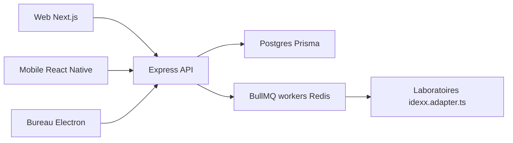

# YosemiteCrew/Yosemite-Crew

> Système de gestion de cabinet vétérinaire ouvert, avec web, mobile, bureau et plateforme pour développeurs.

## Le problème
Les logiciels vétérinaires sont fermés, sous abonnement rigide et sans accès libre aux données cliniques.

## Ce que ça fait vraiment
Monorepo pnpm et Turborepo : interface web (Next.js), API (Express, Prisma, Socket.IO, BullMQ), application mobile (React Native), client de bureau (Electron, synchronisation hors ligne) et documentation. Postgres (Supabase) isole les clients par schéma. Routes FHIR R4, intégrations de laboratoires (IDEXX, Merck), paiements Stripe, authentification SuperTokens, services AWS.

## Comment c'est branché


## Essayer
```bash
pnpm install
cp apps/backend/.env.example apps/backend/.env
cp apps/frontend/.env.example apps/frontend/.env
pnpm run dev
```

## Coût et pièges
Node 20, pnpm 8, PostgreSQL et Redis accessibles au démarrage. L'app mobile demande sa propre configuration et des fichiers Firebase. L'accès aux environnements de dev est sur demande. 174 issues ouvertes.

## Ce que ce n'est pas
Pas un produit clé en main : il faut l'héberger et le configurer. Licence présente mais non reconnue : à lire avant usage. Conformité réglementaire annoncée, non démontrée ici.

## Alternatives
Aucune alternative nommée dans le README (il compare l'écosystème à celui des extensions WordPress).

## Pour toi
Ignorer : hors de ton domaine ; son intérêt est l'architecture FHIR et multi-locataire, pas un outil pour ton travail data/IA.

