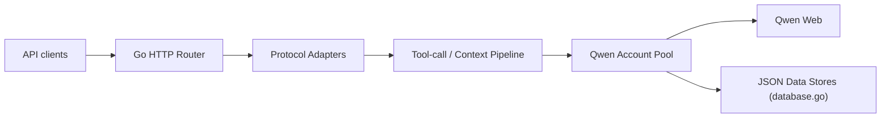

# YuJunZhiXue/qwen2API

> Passerelle auto-hébergée qui expose Qwen Web via des API compatibles OpenAI, Anthropic et Gemini.

## Le problème
Utiliser l'interface web de Qwen depuis des outils qui parlent les protocoles OpenAI, Anthropic ou Gemini.

## Ce que ça fait vraiment
Backend Go avec WebUI React : des adaptateurs de protocole traduisent les requêtes (`/v1/chat/completions`, `/v1/messages`, `generateContent`, images, vidéos), un pipeline de contexte et d'appels d'outils les prépare, puis un pool de comptes Qwen les envoie vers Qwen Web. Gestion de comptes, clés d'API aval, réglages, tests de chat/image/vidéo et sondes de santé.

## Comment c'est branché


## Essayer
```bash
mkdir -p data logs
docker compose pull
docker compose up -d
docker compose logs -f qwen2api
```
Avec un `.env` (`ADMIN_KEY`) et le `docker-compose.yml` du README (image `yujunzhixue/qwen2api:latest`, port 7860).

## Coût et pièges
Gratuit côté passerelle mais exige des comptes Qwen (jetons, éventuellement mot de passe dans l'environnement). Le README demande de vérifier les règles des plateformes amont ; aucune licence déclarée.

## Ce que ce n'est pas
N'est pas une API officielle Qwen : il passe par l'interface web, donc fragile et sujette aux règles du fournisseur.

## Alternatives
Aucune alternative nommée dans le README.

## Pour toi
À ignorer : dépend du scraping d'un service web tiers, sans licence déclarée ; utilise plutôt l'API officielle du fournisseur.

