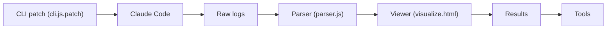

# Yuyz0112/claude-code-reverse

> Analyse par le trafic API du fonctionnement interne de Claude Code, avec prompts et outils extraits.

## Le problème
Comprendre comment un agent de code abouti orchestre ses prompts et outils, alors que le code source est minifié.

## Ce que ça fait vraiment
Un correctif `cli.js.patch` intercepte `beta.messages.create` du SDK Anthropic et journalise requêtes et réponses. `parser.js` structure les journaux, `visualize.html` les affiche en repérant les prompts communs. Le dossier de résultats contient les prompts (workflow, compaction, détection de sujet, IDE) et les définitions d'outils en YAML. La v1 (analyse de bundle par LLM) est archivée.

## Comment c'est branché


## Essayer
```bash
which claude
mv cli.js cli.bak
js-beautify cli.bak > cli.js
```
Puis appliquer `cli.js.patch` (détails dans le dépôt) ; un `messages.log` est créé à chaque lancement.

## Coût et pièges
Suppose une installation de Claude Code (compte à ta charge). Modifier les fichiers installés peut casser à la prochaine mise à jour. Aucune licence déclarée : réutilisation des prompts extraits à vérifier. Le README note que ce type de reverse engineering n'est pas soutenu par Anthropic.

## Ce que ce n'est pas
Pas un outil à déployer : un travail d'étude, daté de juillet 2025 (modèles Sonnet 4, Haiku 3.5).

## Alternatives
Aucune alternative nommée dans le README.

## Pour toi
À surveiller comme lecture : utile pour concevoir tes propres agents (prompts, sous-agents, compaction), mais sans licence et figé sur une version ancienne.
