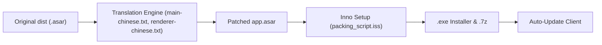

# Z-Siqi/Clash-for-Windows_Chinese

> Version non officielle et traduite en chinois du client proxy Clash for Windows, distribuée en installeur modifié.

## Le problème
Clash for Windows n'est pas disponible en chinois ; ce dépôt modifie le paquet d'origine pour traduire l'interface.

## Ce que ça fait vraiment
Le dépôt patche le fichier `app.asar` (renderer.js, main.js) avec des tables de remplacement, puis empaquette le résultat avec Inno Setup (installeur .exe) ou en archive 7z. Le README annonce que l'installeur « détourne » le mécanisme de mise à jour pour livrer les versions traduites, et qu'un lien tiers (Clash-for-Windows_Chinese-Attached) est injecté. Une version « Optimize » avec sources est mentionnée.

## Comment c'est branché

## Essayer
Aucune commande ; le README décrit un téléchargement d'installeur ou d'archive 7z depuis les releases.

## Coût et pièges
Gratuit. Binaire modifié, mise à jour détournée, lien tiers injecté et publicité pour un fournisseur de proxy dans le README. Le README dit ne pas fournir d'aide pour la Chine continentale. Aucune licence déclarée.

## Ce que ce n'est pas
Ce n'est pas le logiciel officiel : le README demande de repasser à l'original avant tout signalement de bug. Le README barre une mention d'archivage de novembre 2023, alors que le catalogue indique non archivé.

## Alternatives
- Le client Clash for Windows d'origine, cité comme version officielle.

## Pour toi
Ignorer : un exécutable retouché avec mise à jour détournée est un risque inutile, et aucun rapport avec le travail data/IA/MLOps.

