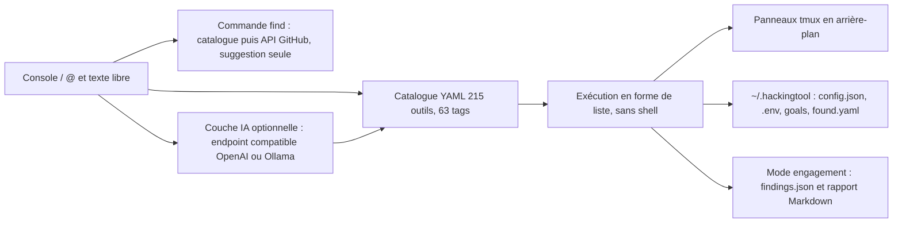

# Z4nzu/hackingtool

> **A Python console that installs and launches 215 security tools, for authorized testing only.**

## The problem

Every engagement starts with the same chore: tracking down each tool's repository, installing it by
hand, remembering the exact syntax, then doing it all again on the next machine. The reverse problem
is just as real — knowing which tool exists for a need you have not met yet.

## What it actually does

hackingtool is an interactive console holding a catalog of 215 tools across 21 categories, with a
fixed taxonomy of 63 tags. It does not reimplement the tools: it installs them, runs them and hands
you the documented command. `/search` and `@tag:` walk the catalog; `/find` searches the catalog
first, then the GitHub search API, in suggest-only mode — it never clones or runs anything and makes
zero model calls. An optional AI layer maps plain English to tags from the fixed taxonomy (`/ai`),
plans an objective step by step with per-step confirmation (`/goal`), and summarizes real findings in
engagement mode. The README stresses standard installs, no `curl | bash`, pinned downloads verified
by SHA-256, and list-form `subprocess` calls. With tmux, `/run … &` opens a detached pane. A
non-interactive mode (`--engagement`) normalizes output into one `findings.json` and produces a
deterministic Markdown report.

## How it is wired



The single entry point is the console, with only three input forms (`/command`, `@thing`, free
text). Everything resolves through the catalog, which is the source of truth — the model may only
return existing tags, so it cannot invent a tool. Execution is list-form, never through a shell, and
state (settings, the API key at mode 600, goal workspaces, discovered tools) lives under
`~/.hackingtool/`.

## Trying it

```bash
git clone https://github.com/Z4nzu/hackingtool.git
cd hackingtool
pipx install .
hackingtool
```

Container variant, as documented:

```bash
docker run -it --rm hardikzinzu/hackingtool:latest
```

Headless mode:

```bash
hackingtool --engagement acme --targets example.com --pipeline recon
hackingtool --engagement acme --report
```

## Cost and traps

The project is free and open source; the real cost is elsewhere. Python 3.10+ on Linux or macOS —
Windows is not supported, the app says so and exits. Several catalog tools need a third-party
runtime: Go 1.21+ (nuclei, ffuf, amass, httpx, katana, dalfox, gobuster, subfinder), Ruby, tmux for
background panes, Docker for Mythic and MobSF. The AI layer is opt-in and bring-your-own-key: an
OpenAI-compatible endpoint with the bill on you, or a local Ollama, otherwise every feature falls
back to a deterministic offline behaviour. `/find` runs at 10 GitHub searches per minute anonymously,
30 with a no-scope token. PyPI and the `.deb` are announced but commented out in the README: those
channels are not live, so installing means cloning. Finally, the legal frame is the real cost:
authorized targets only, and out-of-scope asks (jamming, DoS, mass-targeting, malware) are refused
before any network call.

## What it is not

This is not a security distribution and not a replacement for Kali: it is a launcher on top of tools
written by others, and each tool's quality does not depend on this repository. It is not an
autonomous agent — nothing auto-executes, `/goal` asks for confirmation at every step, and the model
is called once, for planning; tool output is never fed back to it. `/find` does not vet what it finds
on GitHub, as the README states outright. The counts do not agree either: 215 tools advertised, 217
shown in the in-app header, and 59 archived entries hidden by default. The README also carries
showcase framing (Trendshift badges, "safe by default") that should be read as the author's claims.

## Alternatives

The README names no competitor; `wifiphisher/wifiphisher` appears only as sample `/find` output.
Among the catalog neighbours: `usestrix/strix` if you want a security agent rather than a launcher
over existing tools; `HunxByts/GhostTrack` for focused OSINT without the catalog layer;
`bee-san/Ciphey` for decoding, which covers only one slice of the scope. None plays the same
aggregator role.

## For you

Little direct value for day-to-day data/ML work unless you do offensive security or DFIR. The design,
however, is instructive for anyone building agents: a YAML catalog as the source of truth, a model
constrained to a fixed tag vocabulary, deterministic offline degradation, and no implicit execution.
Worth reading as an architecture pattern more than as a tool.
