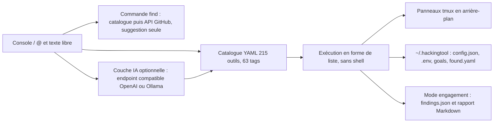

# Z4nzu/hackingtool

> **Console Python qui installe et lance 215 outils de sécurité, pour tests autorisés uniquement.**

## Le problème

Un pentest ou une mission OSINT commence presque toujours par la même corvée : retrouver le dépôt
de chaque outil, l'installer à la main, se souvenir de la syntaxe exacte, et recommencer sur la
machine suivante. Le README pose aussi le problème inverse : savoir quel outil existe pour un
besoin qu'on n'a pas encore rencontré.

## Ce que ça fait vraiment

hackingtool est une console interactive qui tient un catalogue de 215 outils rangés en
21 catégories, avec une taxonomie fixe de 63 tags. Elle ne réimplémente pas les outils : elle les
installe, les lance et donne la commande documentée. `/search` et `@tag:` parcourent le catalogue,
`/find` cherche d'abord dedans puis interroge l'API de recherche GitHub en mode suggestion seule
— sans jamais cloner ni exécuter, et sans appel de modèle. Une couche IA optionnelle traduit une
phrase en langage courant vers des tags du référentiel fixe (`/ai`), planifie un objectif étape par
étape avec confirmation à chaque pas (`/goal`), et résume des résultats réels en mode engagement.
Le README insiste sur des installs standards, sans `curl | bash`, avec téléchargements épinglés et
vérifiés en SHA-256 et appels `subprocess` en forme de liste. Avec tmux, `/run … &` lance un scan
dans un panneau détaché. Un mode non interactif (`--engagement`) normalise les sorties dans un
`findings.json` et produit un rapport Markdown déterministe.

## Comment c'est branché



L'entrée unique est la console : trois formes d'entrée seulement (`/commande`, `@objet`, texte
libre). Tout passe par le catalogue, qui est la source de vérité — le modèle ne peut renvoyer que
des tags existants, donc il ne peut pas inventer d'outil. L'exécution se fait en forme de liste,
jamais via un shell, et l'état (réglages, clé d'API en mode 600, plans d'objectifs, outils
découverts) vit sous `~/.hackingtool/`.

## Essayer

```bash
git clone https://github.com/Z4nzu/hackingtool.git
cd hackingtool
pipx install .
hackingtool
```

Variante conteneur, telle que documentée :

```bash
docker run -it --rm hardikzinzu/hackingtool:latest
```

Mode non interactif :

```bash
hackingtool --engagement acme --targets example.com --pipeline recon
hackingtool --engagement acme --report
```

## Coût et pièges

Le projet est gratuit et open source ; le coût réel est ailleurs. Python 3.10+ sur Linux ou macOS
— Windows n'est pas supporté, l'app le dit et sort. Plusieurs outils du catalogue exigent un
runtime tiers : Go 1.21+ (nuclei, ffuf, amass, httpx, katana, dalfox, gobuster, subfinder), Ruby,
tmux pour les panneaux, Docker pour Mythic et MobSF. La couche IA est opt-in et « bring your own
key » : endpoint compatible OpenAI avec clé à ta charge, ou Ollama local, sinon chaque
fonctionnalité retombe sur un comportement hors ligne déterministe. `/find` tourne à 10 recherches
GitHub par minute en anonyme, 30 avec un jeton sans scope. Le PyPI et le `.deb` sont annoncés mais
commentés dans le README : ces canaux ne sont pas encore ouverts, l'install passe par le clone.
Enfin, le cadre légal est le vrai coût : cibles autorisées uniquement, et les demandes hors
périmètre (brouillage, DoS, ciblage de masse, malware) sont refusées avant tout appel réseau.

## Ce que ce n'est pas

Ce n'est pas une distribution de sécurité ni un remplaçant de Kali : c'est un lanceur au-dessus
d'outils écrits par d'autres, et la qualité de chaque outil ne dépend pas de ce dépôt. Ce n'est pas
un agent autonome — rien ne s'exécute tout seul, `/goal` demande confirmation à chaque étape et le
modèle n'est appelé qu'une fois, pour planifier ; la sortie des outils ne lui est jamais renvoyée.
`/find` ne vérifie pas ce qu'il trouve sur GitHub, le README le dit explicitement. Les compteurs ne
concordent pas non plus d'un endroit à l'autre : 215 outils annoncés, 217 affichés dans l'en-tête,
et 59 entrées archivées cachées par défaut. Le README emploie plusieurs formules de vitrine
(badges Trendshift, « safe by default ») qu'il faut lire comme des revendications de l'auteur.

## Alternatives

Aucun dépôt comparable n'est présenté comme concurrent dans le README ; `wifiphisher/wifiphisher`
n'y apparaît que comme exemple de sortie de `/find`. Parmi les voisins du catalogue :
`usestrix/strix` si l'on cherche un agent de sécurité plutôt qu'un lanceur d'outils existants ;
`HunxByts/GhostTrack` pour de l'OSINT ciblé sans la couche catalogue ; `bee-san/Ciphey` pour du
décodage, qui ne recouvre qu'une case du périmètre. Aucun n'offre le même rôle d'agrégateur.

## Pour toi

Peu d'intérêt direct pour du data/ML au quotidien, sauf si tu fais de la sécurité offensive ou du
DFIR. En revanche, le schéma est instructif pour qui construit des agents : catalogue en YAML comme
source de vérité, modèle contraint à un vocabulaire fixe de tags, dégradation déterministe hors
ligne, aucune exécution implicite. À regarder comme patron d'architecture plus que comme outil.
