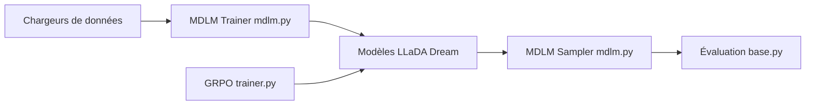

# ZHZisZZ/dllm

> Bibliothèque d'entraînement, d'inférence et d'évaluation de modèles de langage à diffusion (LLaDA, Dream).

## Le problème
Les modèles de langage à diffusion manquent de pipelines communs et reproductibles pour les entraîner, les échantillonner et les évaluer.

## Ce que ça fait vraiment
Fournit des entraîneurs (MDLM, BD3LM) basés sur le Trainer de `transformers` avec LoRA, DeepSpeed, FSDP, des échantillonneurs unifiés, et une évaluation basée sur `lm-evaluation-harness`. Exemples pour LLaDA, Dream, conversion d'un modèle autorégressif (a2d), BERT-Chat, Edit Flows, Fast-dLLM (cache) et GRPO. Le README précise un but éducatif, sans reproduction exacte des modèles officiels.

## Comment c'est branché


## Essayer
```bash
pip install -e .
accelerate launch --config_file scripts/accelerate_configs/zero2.yaml examples/llada/sft.py --num_train_epochs 4 --load_in_4bit True --lora True
python -u examples/llada/chat.py --model_name_or_path "GSAI-ML/LLaDA-8B-Instruct"
```

## Coût et pièges
GPU requis (installation avec CUDA 12.4, PyTorch 2.6.0, conda). L'évaluation demande un sous-module git. Un script Slurm est fourni, à adapter à la partition du cluster.

## Ce que ce n'est pas
Pas un produit : but éducatif déclaré. Les modèles de diffusion de texte ne sont pas encore une alternative reconnue aux modèles autorégressifs dans ce README.

## Alternatives
Aucune alternative nommée dans le README.

## Pour toi
À surveiller : bon point d'entrée pour expérimenter la diffusion de langage, mais réservé à la recherche tant que tu n'as pas de besoin précis.

