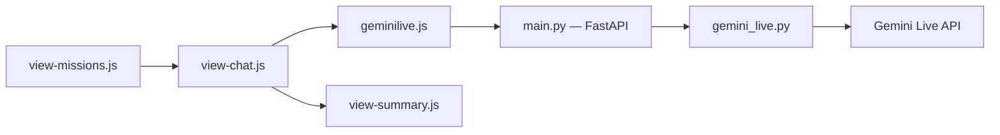

# ZackAkil/immersive-language-learning-with-live-api

> Démo d'application de jeux de rôle vocaux pour apprendre une langue avec Gemini Live.

## Le problème
Pratiquer l'oral d'une langue demande un interlocuteur disponible qui joue des scènes réalistes.

## Ce que ça fait vraiment
Le navigateur envoie l'audio par WebSocket à un serveur FastAPI, qui le relaie à l'API Gemini Live. L'apprenant choisit une mission (acheter un ticket de bus), une langue et un mode (Teacher ou Immersive). Il reçoit un score en fin de session. Options : BigQuery pour les métriques, reCAPTCHA, Redis pour la limitation de débit.

## Comment c'est branché


## Essayer
```bash
git clone <repository-url>
cd immersive-language-learning-with-live-api
./scripts/install.sh
cp .env.example .env
./scripts/dev.sh
```

## Coût et pièges
Projet Google Cloud avec Vertex AI et identifiants ADC. Le README estime environ 1,7 centime pour une minute de conversation (tarif au 19 janvier 2026). Déploiement Cloud Run en un clic.

## Ce que ce n'est pas
Une démo, pas un produit d'apprentissage : pas de suivi de progression. Dernier push en avril 2026.

## Alternatives
Aucune alternative nommée dans le README.

## Pour toi
À surveiller : bon exemple de référence pour une application audio temps réel sur Gemini Live, sans intérêt direct si tu ne travailles pas sur Google Cloud.

