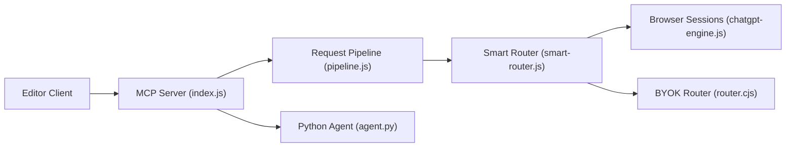

# Zen4-bit/Proxima

> Passerelle locale qui expose des sessions de navigateur ChatGPT, Claude ou Gemini comme serveur MCP et API OpenAI.

## Le problème
Les appels d'API aux modèles de pointe coûtent à chaque prompt ; l'auteur veut les utiliser depuis ses outils de code via ses comptes gratuits.

## Ce que ça fait vraiment
Application Electron avec serveur MCP Node (40 outils), API REST compatible OpenAI sur `:3210` et WebSocket. Deux modes : sessions web (automatisation de comptes connectés dans des vues de navigateur) ou BYOK (OpenAI, Anthropic, Groq, Ollama, LM Studio…, clés dans le coffre de l'OS). Inclut un agent Python avec mémoire SQLite, exécution gatée (Full Auto, Smart, Suggest) et un CLI.

## Comment c'est branché


## Essayer
```bash
git clone https://github.com/Zen4-bit/Proxima.git
cd Proxima
npm install
npm start
```

## Coût et pièges
Le mode session est gratuit mais le README admet qu'il peut sortir des conditions d'utilisation des fournisseurs ; pour un usage pro, il recommande BYOK. Le mode session envoie tes prompts à ces fournisseurs. Node 18+, Python 3.10+ pour l'agent. Licence « présente mais non identifiée ».

## Ce que ce n'est pas
Ce n'est pas un accès légitime « gratuit » aux API : il automatise des comptes web. Pas de garantie de stabilité, les interfaces web changent.

## Alternatives
Aucune alternative nommée dans le README.

## Pour toi
À ignorer : le risque de blocage de compte et de non-conformité aux conditions d'utilisation, plus la licence floue, pèsent plus que l'économie ; préfère des clés d'API officielles.

