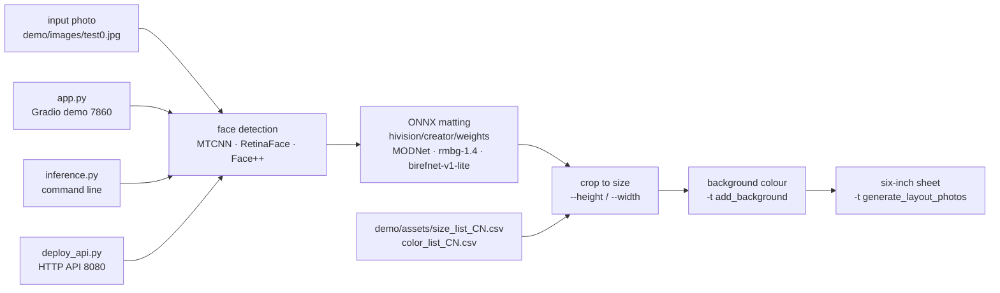

# Zeyi-Lin/HivisionIDPhotos

> **A local pipeline turning an ordinary photo into an ID photo at the required size.**

## The problem

Producing a compliant ID photo means cutting the subject out cleanly, cropping to an official
size to the millimetre, laying a flat background behind it and tiling several copies on one
print sheet. Done by hand in an image editor it is slow and the crop is guesswork; done through
an online service it means handing someone's face to a third party.

## What it actually does

The project chains four steps it performs itself: face detection, portrait matting, cropping to
the requested dimensions, then background colour and generation of a six-inch print layout.
Inference runs through ONNX **on CPU**: the README measures MODNet + mtcnn at 410 MB of memory
and around 0.2 s per image on a Mac M1 Max.

Four matting models are offered for download (MODNet, hivision_modnet, rmbg-1.4,
birefnet-v1-lite, from 24.7 MB to 224 MB) and three face detectors (offline MTCNN by default,
offline RetinaFace for better accuracy, online Face++). Weights do not ship with the code:
`scripts/download_model.py` fetches them into `hivision/creator/weights`.

Three entry points share the same core: a Gradio demo (`app.py`), a command line
(`inference.py`, with modes `idphoto`, `human_matting`, `add_background`,
`generate_layout_photos`, `idphoto_crop`) and an HTTP service (`deploy_api.py`, port 8080).
Preset sizes and colours are editable CSV files (`demo/assets/size_list_CN.csv`,
`color_list_CN.csv`). A watermark, social-media templates and a retouching option come with it.
Automatic change of clothing is listed as not done yet.

## How it is wired

No code-derived diagram exists for this repository: the graph below is rebuilt from the README
alone, using the file names it cites.



## Trying it

```bash
git clone https://github.com/Zeyi-Lin/HivisionIDPhotos.git
cd  HivisionIDPhotos

pip install -r requirements.txt
pip install -r requirements-app.txt

python scripts/download_model.py --models all

python app.py
```

From the command line, the README's own examples:

```bash
python inference.py -i demo/images/test0.jpg -o ./idphoto.png --height 413 --width 295
python inference.py -t human_matting -i demo/images/test0.jpg -o ./idphoto_matting.png --matting_model hivision_modnet
python inference.py -t add_background -i ./idphoto.png -o ./idphoto_ab.jpg  -c 4f83ce -k 30 -r 1
python inference.py -t generate_layout_photos -i ./idphoto_ab.jpg -o ./idphoto_layout.jpg  --height 413 --width 295 -k 200
python deploy_api.py
```

In containers:

```bash
docker pull linzeyi/hivision_idphotos
docker run -d -p 7860:7860 linzeyi/hivision_idphotos
docker run -d -p 8080:8080 linzeyi/hivision_idphotos python3 deploy_api.py
docker compose up -d
```

## Cost and gotchas

- **Free and offline by default.** No account and no key are needed for the MODNet + MTCNN path.
  Python >= 3.7, mostly tested on 3.10, on Linux, Windows or macOS.
- **Weights are a separate download**, and the README warns the throughput may be poor: a
  SwanHub mirror is offered. A locally built Docker image with no weights in
  `hivision/creator/weights` will not work.
- **The most accurate model is expensive**: birefnet-v1-lite + RetinaFace costs 6.20 GB of
  memory and about 7 s per image on CPU in the README's table. Only birefnet-v1-lite benefits
  from NVIDIA GPU acceleration, and the README asks for "around 16 GB" of VRAM plus CUDA, cuDNN
  and a matching `onnxruntime-gpu`.
- **Beast mode (`RUN_MODE=beast`)** keeps models resident in memory for faster repeat
  inference; the README suggests it above 16 GB of RAM.
- **Face++ is the only third-party service**, and it is optional: it needs `FACE_PLUS_API_KEY`
  and `FACE_PLUS_API_SECRET` from the Megvii console, and sends the image off the machine.
  Without those variables nothing leaves the host.

## What it is not

- **It is not a guarantee of administrative compliance.** The tool crops to whatever dimensions
  you give it; the shipped presets are Chinese CSV files you must edit yourself
  (`size_list_CN.csv`) for another country. Nothing in the README validates a photo against a
  regulation.
- **It is not a matting model**: the weights come from MODNet, BRIA RMBG-1.4 and BiRefNet,
  third-party projects with their own licences — the repository's Apache-2.0 covers the code
  that orchestrates them, not necessarily the models or your commercial use of them.
- **It is not a multi-tenant service ready to expose**: `deploy_api.py` is a bare backend with
  no documented authentication or quota, and beast mode assumes a dedicated machine.

## Alternatives

| | When to prefer it |
|---|---|
| **ZHKKKe/MODNet**, **ZhengPeng7/BiRefNet**, **briaai/RMBG-1.4** | Named in the README as the weight providers. Take them directly if all you need is matting: HivisionIDPhotos then only adds cropping, background and print layout. |
| **zjkhahah/HivisionIDPhotos-cpp** | A C++ port linked from the README. Prefer it to embed the pipeline without a Python environment. |
| **serengil/deepface** | A catalogue neighbour: face recognition and analysis (identity, age, emotion), not ID photo production. Choose it when the question is "who is this", not "how do I print it". |

## For you

Little to do with an MLOps stack, but it is a well-executed case study of an all-ONNX CPU vision
pipeline, with three interfaces (Gradio, CLI, API) plugged into one core and published memory
and latency figures per model combination: a template worth copying when you must ship local
image processing. Adopt it as a design reference, and as an occasional tool when the constraint
is that a face must not leave your machine.
