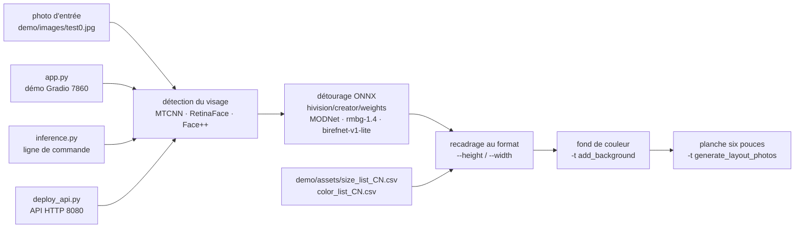

# Zeyi-Lin/HivisionIDPhotos

> **Chaîne locale qui transforme une photo quelconque en photo d'identité au format demandé.**

## Le problème

Fabriquer une photo d'identité conforme suppose de détourer la personne proprement, de recadrer
au millimètre selon un format officiel, de poser un fond uni et d'imprimer plusieurs vignettes
sur un même tirage. Fait à la main dans un éditeur d'images, c'est long et le recadrage est
approximatif ; fait par un service en ligne, cela suppose d'envoyer un visage à un tiers.

## Ce que ça fait vraiment

Le projet enchaîne quatre opérations qu'il assure lui-même : détection du visage, détourage
(matting) du portrait, recadrage aux dimensions voulues, puis ajout d'un fond de couleur et
génération d'une planche de tirage six pouces. L'inférence se fait en ONNX, **sur CPU** :
le README mesure MODNet + mtcnn à 410 Mo de mémoire et environ 0,2 s par image sur un Mac M1 Max.

Quatre modèles de détourage sont proposés au téléchargement (MODNet, hivision_modnet, rmbg-1.4,
birefnet-v1-lite, de 24,7 Mo à 224 Mo) et trois détecteurs de visage (MTCNN hors ligne par défaut,
RetinaFace hors ligne plus précis, Face++ en ligne). Les poids ne sont pas livrés avec le code :
`scripts/download_model.py` les récupère dans `hivision/creator/weights`.

Trois portes d'entrée pour le même cœur : une démo Gradio (`app.py`), une ligne de commande
(`inference.py`, avec les modes `idphoto`, `human_matting`, `add_background`,
`generate_layout_photos`, `idphoto_crop`) et un service HTTP (`deploy_api.py`, port 8080).
Les formats et couleurs prédéfinis sont des fichiers CSV éditables (`demo/assets/size_list_CN.csv`,
`color_list_CN.csv`). S'ajoutent un filigrane, des modèles de photos pour réseaux sociaux et une
option de « beauté ». Le changement de tenue vestimentaire est annoncé comme non fait.

## Comment c'est branché

Aucun diagramme tiré du code n'existe pour ce dépôt : ce schéma est reconstruit depuis le seul
README, avec les noms de fichiers qu'il cite.



## Essayer

```bash
git clone https://github.com/Zeyi-Lin/HivisionIDPhotos.git
cd  HivisionIDPhotos

pip install -r requirements.txt
pip install -r requirements-app.txt

python scripts/download_model.py --models all

python app.py
```

En ligne de commande, les exemples du README :

```bash
python inference.py -i demo/images/test0.jpg -o ./idphoto.png --height 413 --width 295
python inference.py -t human_matting -i demo/images/test0.jpg -o ./idphoto_matting.png --matting_model hivision_modnet
python inference.py -t add_background -i ./idphoto.png -o ./idphoto_ab.jpg  -c 4f83ce -k 30 -r 1
python inference.py -t generate_layout_photos -i ./idphoto_ab.jpg -o ./idphoto_layout.jpg  --height 413 --width 295 -k 200
python deploy_api.py
```

Par conteneur :

```bash
docker pull linzeyi/hivision_idphotos
docker run -d -p 7860:7860 linzeyi/hivision_idphotos
docker run -d -p 8080:8080 linzeyi/hivision_idphotos python3 deploy_api.py
docker compose up -d
```

## Coût et pièges

- **Gratuit et hors ligne par défaut.** Aucun compte, aucune clé n'est nécessaire pour la voie
  MODNet + MTCNN. Python >= 3.7, testé surtout en 3.10, sur Linux, Windows ou macOS.
- **Les poids se téléchargent à part**, et le README signale que le débit peut être mauvais :
  un miroir SwanHub est proposé. Une image Docker construite localement sans poids dans
  `hivision/creator/weights` ne fonctionnera pas.
- **Le modèle le plus précis coûte cher** : birefnet-v1-lite + RetinaFace, c'est 6,20 Go de
  mémoire et environ 7 s par image sur CPU d'après le tableau du README. Seul birefnet-v1-lite
  profite d'une accélération GPU NVIDIA, et le README réclame « environ 16 Go » de VRAM, plus
  CUDA, cuDNN et le bon `onnxruntime-gpu`.
- **Le « mode bête » (`RUN_MODE=beast`)** garde les modèles en mémoire pour accélérer les
  inférences suivantes : conseillé au-delà de 16 Go de RAM.
- **Face++ est le seul service tiers**, facultatif : il demande `FACE_PLUS_API_KEY` et
  `FACE_PLUS_API_SECRET` obtenus sur la console Megvii, et fait sortir l'image de la machine.
  Sans ces variables, rien ne part sur le réseau.

## Ce que ce n'est pas

- **Ce n'est pas une garantie de conformité administrative.** L'outil recadre aux dimensions
  qu'on lui donne ; les formats livrés sont des CSV chinois qu'il faut éditer soi-même
  (`size_list_CN.csv`) pour un autre pays. Rien dans le README ne valide une photo au regard
  d'une réglementation.
- **Ce n'est pas un modèle de détourage** : les poids viennent de MODNet, BRIA RMBG-1.4 et
  BiRefNet, projets tiers avec leurs propres licences — l'Apache-2.0 du dépôt couvre le code
  qui les orchestre, pas forcément les modèles ni l'usage commercial qu'on en fait.
- **Ce n'est pas un service multi-utilisateur prêt à exposer** : `deploy_api.py` est un backend
  nu, sans authentification ni quota documentés, et le « mode bête » suppose une machine dédiée.

## Alternatives

| | Quand le préférer |
|---|---|
| **ZHKKKe/MODNet**, **ZhengPeng7/BiRefNet**, **briaai/RMBG-1.4** | Nommés dans le README comme fournisseurs de poids. À prendre directement si le besoin est le détourage seul : HivisionIDPhotos n'apporte alors que le recadrage, le fond et la mise en planche. |
| **zjkhahah/HivisionIDPhotos-cpp** | Portage C++ signalé par le README. À préférer pour embarquer la chaîne sans environnement Python. |
| **serengil/deepface** | Voisin du catalogue : reconnaissance et analyse de visages (identité, âge, émotion), pas de production de photo d'identité. À choisir si la question est « qui est-ce » et non « comment l'imprimer ». |

## Pour toi

Peu de rapport avec une pile MLOps, mais c'est un cas d'école bien fait de chaîne de vision
100 % ONNX sur CPU, avec ses trois interfaces (Gradio, CLI, API) branchées sur le même cœur et
ses chiffres de mémoire et de latence publiés par combinaison de modèles : un modèle à copier
quand on doit livrer un traitement d'image local. À adopter comme référence de conception, et
comme outil ponctuel quand la contrainte est de ne pas envoyer un visage chez un tiers.
