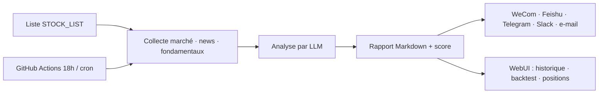

# ZhuLinsen/daily_stock_analysis

> Analyse quotidienne d'un portefeuille d'actions par LLM, poussée vers une messagerie.

## Le problème
Suivre une liste de titres sur plusieurs places demande d'agréger cours, actualités, annonces et fondamentaux chaque jour à la main.

## Ce que ça fait vraiment
Agrège les données de marché (A-shares, Hong Kong, US, Japon, Corée, Taïwan, ETF), les news et le sentiment, puis fait produire par un LLM un « tableau de bord de décision » : conclusion, score, tendance, points d'achat/vente, alertes de risque, catalyseurs. Pousse le résultat vers WeCom, Feishu, Telegram, Discord, Slack ou e-mail. Interface web avec analyse manuelle, historique, backtest, positions, et un mode « Agent » à 15 stratégies intégrées (moyennes mobiles, chanlun, vagues, tendance, événementiel…).

## Comment c'est branché


## Essayer
```bash
git clone https://github.com/ZhuLinsen/daily_stock_analysis.git && cd daily_stock_analysis
pip install -r requirements.txt
cp .env.example .env && vim .env
python main.py --stocks 600519,hk00700,AAPL,2330.TW
python main.py --webui
```

## Coût et pièges
Au moins une clé LLM et un canal de notification sont obligatoires. Les sources de marché gratuites (AkShare, Baostock, YFinance) subissent le rate-limiting amont et les changements d'interface : pour du planifié, le README recommande des sources à token (TickFlow, Tushare, Longbridge), payantes. Le README met en avant des offres promotionnelles de fournisseurs d'API.

## Ce que ce n'est pas
Le README le dit lui-même : usage d'étude et de recherche, aucun conseil d'investissement, l'auteur décline toute responsabilité de perte. Ce n'est pas un moteur de sélection de titres — ce rôle est renvoyé au projet AlphaSift. Documentation quasi entièrement en chinois.

## Alternatives
- AlphaSift : la sélection de titres, que ce projet ne fait pas.
- AlphaEvo : backtest et évolution de stratégies.

## Pour toi
À surveiller comme patron d'architecture « collecte → LLM → push planifié », plus que comme outil financier.
