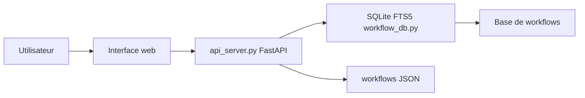

# Zie619/n8n-workflows

> Collection de milliers de workflows n8n exportés, avec un moteur de recherche local ou en ligne.

## Le problème
Trouver un modèle de workflow n8n prêt à importer pour un cas d'usage donné (marketing, DevOps, ventes…) demande de fouiller à la main.

## Ce que ça fait vraiment
Le dépôt réunit des fichiers JSON de workflows (le README compte 4 343 workflows, 365 intégrations, 15 catégories : chiffres non vérifiés ici) et une application FastAPI avec SQLite FTS5 : recherche plein texte, filtres par catégorie, complexité, déclencheur ou service, export et statistiques. Un site GitHub Pages permet de parcourir sans installation.

## Comment c'est branché


## Essayer
```bash
git clone https://github.com/Zie619/n8n-workflows.git
cd n8n-workflows
pip install -r requirements.txt
python run.py
docker run -p 8000:8000 zie619/n8n-workflows:latest
```

## Coût et pièges
Gratuit ; il faut ensuite disposer d'une instance n8n et de comptes des services appelés. Le README affirme « production-ready » et « 100% import success » (allégations non vérifiées) ; pas de licence par workflow.

## Ce que ce n'est pas
Ce n'est pas n8n lui-même. Le rapport d'architecture décrit un dépôt de données sans serveur : le README, qui fait foi, décrit une application FastAPI.

## Alternatives
Aucune alternative nommée dans le README.

## Pour toi
Surveiller : bonne source d'idées d'automatisation, à relire avant d'importer (credentials, appels externes).

