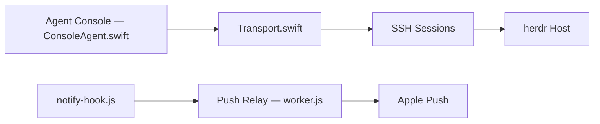

# ZingerLittleBee/Heeler

> Application iOS pour suivre et piloter par SSH les agents de code tournant sur vos machines sous herdr.

## Le problème
Quand un agent de code se bloque ou termine, il faut retourner devant sa machine pour le savoir et lui répondre.

## Ce que ça fait vraiment
Heeler liste sur iPhone/iPad les agents de chaque machine, triés par état (bloqués en premier). Il ouvre leur vrai terminal (rendu libghostty), propose un éditeur de message natif, un shell simple, l'envoi de fichiers par SFTP et l'appairage par QR. Il parle à l'API JSON de herdr via SSH, avec notifications chiffrées et Live Activities via un relais.

## Comment c'est branché


## Essayer
```bash
herdr plugin install ZingerLittleBee/Heeler/plugin --ref main --yes
herdr plugin action invoke heeler.pair
```

## Coût et pièges
Nécessite herdr (≥ 0.7.5), Node ≥ 20 et un serveur SSH avec redirection stream-local. Les notifications passent par un relais, qui ne peut pas lire le contenu selon le README. Disponible sur l'App Store, pas dans tous les pays.

## Ce que ce n'est pas
Pas un agent ni un client herdr officiel : le README précise qu'il n'est pas affilié à herdr. Conçu d'abord pour un usage personnel.

## Alternatives
Aucune alternative nommée dans le README.

## Pour toi
À surveiller : pertinent seulement si tu utilises herdr et des agents longs sur serveur ; sinon la dépendance à cet écosystème pèse trop.

