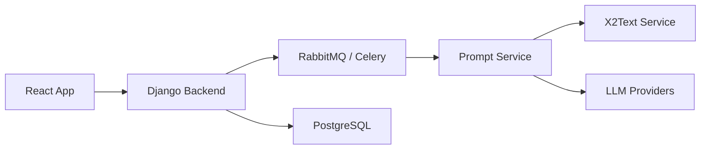

# Zipstack/unstract

> Plateforme d'extraction de JSON structuré depuis des documents via LLM, en API ou ETL.

## Le problème
Extraire des champs de factures ou de formulaires variés demande des regex et des templates par fournisseur.

## Ce que ça fait vraiment
Prompt Studio : définir un schéma d'extraction par prompts en langage naturel.
Déploiement en API REST (document en entrée, JSON en sortie) ou en pipeline ETL (S3, Drive… vers Snowflake, BigQuery…).
Adaptateurs LLM (OpenAI, Anthropic, Bedrock, Ollama…), bases vectorielles, extracteurs de texte (LLMWhisperer, Unstructured).
Serveur MCP et nœud n8n.

## Comment c'est branché


## Essayer
```bash
git clone https://github.com/Zipstack/unstract.git
cd unstract
./run-platform.sh
```

## Coût et pièges
Il faut 8 Go de RAM minimum et une clé LLM. Perdre `ENCRYPTION_KEY` rend les adaptateurs inutilisables. PostHog est activé par défaut.

## Ce que ce n'est pas
La vérification par double LLM, la validation humaine et le SSO sont réservés à l'offre cloud ou entreprise.

## Alternatives
Aucune alternative nommée dans le README.

## Pour toi
À surveiller pour l'extraction documentaire en production : complet et auto-hébergeable, mais AGPL, lourd, et les fonctions de fiabilité sont payantes.
