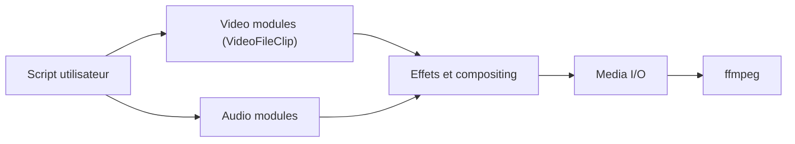

# Zulko/moviepy

> Bibliothèque Python d'édition vidéo par script : coupes, montage, titres, effets, export.

## Le problème
Monter ou transformer des vidéos et des GIF de façon reproductible, sans logiciel de montage graphique.

## Ce que ça fait vraiment
Charge des médias, les convertit en objets Python (tableaux NumPy, un pixel = une valeur accessible) et permet de découper, concaténer, superposer avec transparence, ajouter du texte, appliquer des effets audio et vidéo, puis ré-encoder en mp4, webm ou gif. Les entrées/sorties passent par ffmpeg. Le README prévient : plus lent qu'ffmpeg direct.

## Comment c'est branché


## Essayer
```bash
pip install moviepy
pip install -e .
pip install "moviepy[doc]"
```
Le README fournit aussi un exemple Python (`VideoFileClip(...).subclipped(10, 20)` puis `CompositeVideoClip`).

## Coût et pièges
Gratuit. La version 2.0 apporte des ruptures de compatibilité : le code v1 doit être migré, et la v1 n'est plus maintenue. Les polices (`TextClip`) et un ffmpeg personnalisé peuvent demander une configuration.

## Ce que ce n'est pas
Ce n'est pas un moteur de traitement vidéo performant ni un outil de vision par ordinateur. Pour de gros volumes, ffmpeg seul reste plus rapide.

## Alternatives
Le README ne nomme que ffmpeg, plus rapide en direct mais moins pratique à scripter.

## Pour toi
Adopter : pratique pour préparer des extraits ou des démos vidéo en Python (annotation, montage de résultats de modèles), avec des mainteneurs actifs ; ne pas l'employer pour du traitement à grande échelle.

