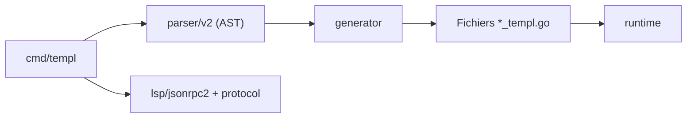

# a-h/templ

> Langage de gabarits HTML pour Go, avec compilateur, formateur et serveur LSP pour l'éditeur.

## Le problème
Les gabarits HTML de la bibliothèque standard Go sont peu typés et mal outillés dans l'éditeur.

## Ce que ça fait vraiment
Le README ne contient que des tâches de développement et un lien vers `templ.guide`. D'après le code : la commande `templ generate` lit des fichiers `.templ`, les analyse (`parser/v2`), produit du Go (`*_templ.go`) via un générateur, et le code généré s'appuie sur un runtime. `templ fmt` formate, `templ lsp` sert l'éditeur.

## Comment c'est branché


## Essayer
```bash
go run ./cmd/templ generate -include-version=false
go test ./...
go run ./cmd/templ fmt .
```

## Coût et pièges
Gratuit. Le README décrit les tâches de contribution (version, build, tests, fuzz, docs) et non l'installation d'un utilisateur : tout l'usage est dans la documentation externe.

## Ce que ce n'est pas
Pas une bibliothèque d'interface à part entière : c'est un compilateur qui produit du Go. README quasi vide côté utilisateur, donc peu vérifiable ici.

## Alternatives
Aucune alternative nommée dans le README.

## Pour toi
À ignorer : outil de rendu HTML pour Go, sans intérêt pour un profil data/IA/MLOps ; le README n'apporte ici presque aucune matière.

