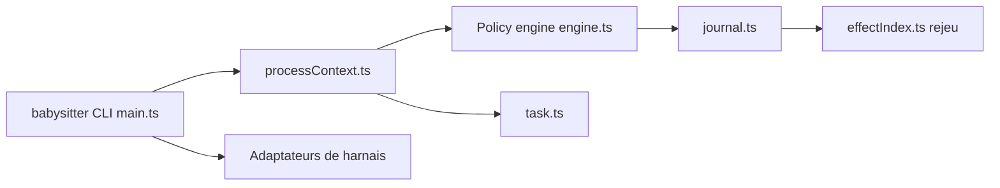

# a5c-ai/babysitter

> Orchestrateur qui contraint des agents de codage à suivre un processus écrit en JavaScript, avec points d'arrêt humains.

## Le problème
Un agent décide seul quand il a fini, sans garde-fous ni trace ; les workflows longs dérivent et ne reprennent pas après coupure.

## Ce que ça fait vraiment
Le processus est du code JavaScript : tâches, points d'arrêt d'approbation humaine, portes de qualité, parallélisme. Un arrêt obligatoire après chaque étape laisse le processus décider de la suite. Toutes les décisions vont dans un journal événementiel pour rejeu et reprise. Douze harnais supportés (Claude Code, Codex, Cursor, Gemini CLI, Copilot…), un harnais interne sans agent externe, compression des jetons (hooks) et bibliothèque de processus. Le dépôt contient aussi un backlog Kanban et la plateforme d'inférence Kradle.

## Comment c'est branché


## Essayer
```bash
npm install -g @a5c-ai/babysitter
claude plugin marketplace add a5c-ai/babysitter-claude
claude plugin install --scope user babysitter@a5c.ai
claude "/babysitter:call implement user authentication with TDD"
```

## Coût et pièges
Node 20+ (22.13+ pour le CLI `adapters`), un harnais installé ; jetons à ta charge. La plupart des harnais hors Claude Code sont « expérimentaux » ou en bêta. 427 issues ouvertes. Plusieurs paquets à distinguer.

## Ce que ce n'est pas
L'annonce « sans hallucination » n'est pas démontrée : le processus contraint le flux, pas le contenu généré. Les réductions de jetons (50 à 67 %) sont les chiffres de l'auteur. Le README est très large (Kradle, atlas, kip-sdk).

## Alternatives
Aucune alternative nommée dans le README.

## Pour toi
À surveiller : l'approche processus-comme-code avec journal rejouable vaut d'être étudiée pour l'orchestration d'agents, mais le périmètre est large et instable.

