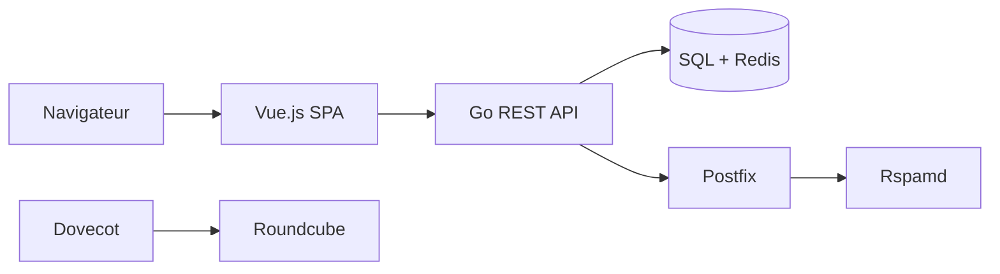

# aaPanel/BillionMail

> Serveur de courriel et plateforme d'emailing auto-hébergés, pour entreprises qui envoient des campagnes.

## Le problème
Les plateformes d'emailing sont chères ou fermées, et un serveur mail se monte difficilement à la main.

## Ce que ça fait vraiment
Un ensemble de conteneurs : backend Go, interface Vue, Postfix (SMTP), Dovecot (IMAP/POP3), Rspamd (antispam), Roundcube en webmail, base SQL et Redis. Il gère domaines, DNS, SSL, campagnes, modèles, contacts et statistiques. Le README annonce huit minutes d'installation et un envoi illimité : affirmations non vérifiées.

## Comment c'est branché


## Essayer
```bash
cd /opt && git clone https://github.com/aaPanel/BillionMail && cd BillionMail && bash install.sh
bm help
bm show-record
```

## Coût et pièges
Il faut un serveur avec IP, DNS et réputation d'envoi corrects ; la délivrabilité reste à ta charge. Licence AGPL-3.0. Le texte du README se dit « futur » outil.

## Ce que ce n'est pas
Ce n'est pas un service gérant la réputation d'envoi. « Sans limite » ne dit rien de ce que les fournisseurs acceptent.

## Alternatives
Aucune alternative nommée dans le README (Roundcube y est un composant intégré).

## Pour toi
À surveiller : intéressant pour un mail souverain, mais sans lien direct avec la data/IA et lourd à opérer.

